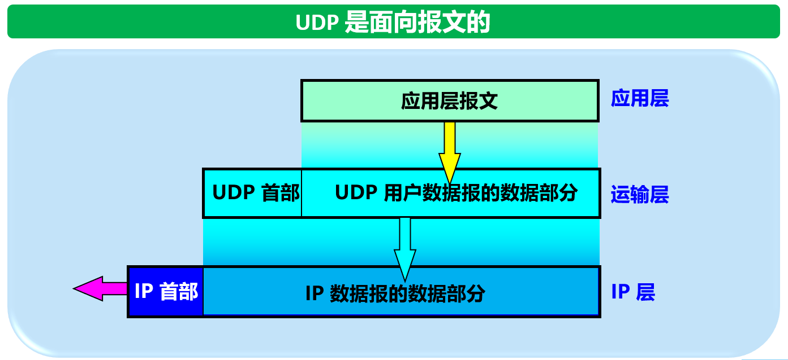
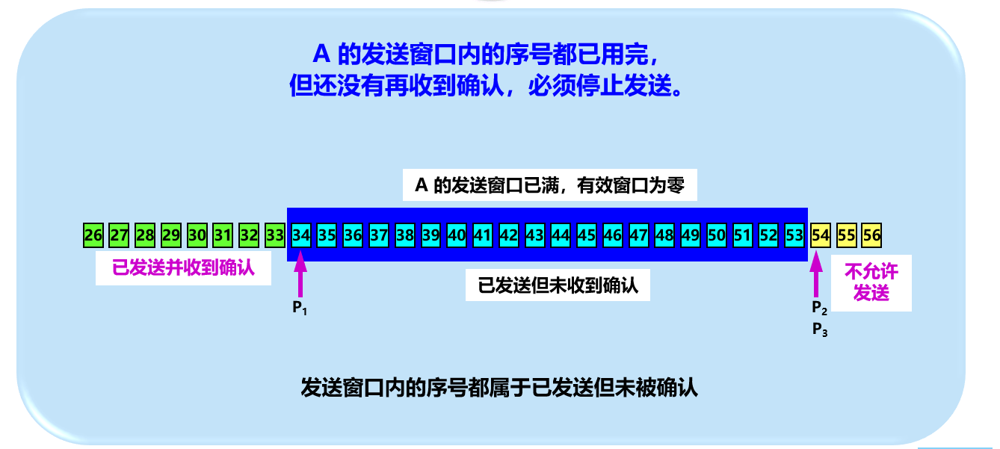
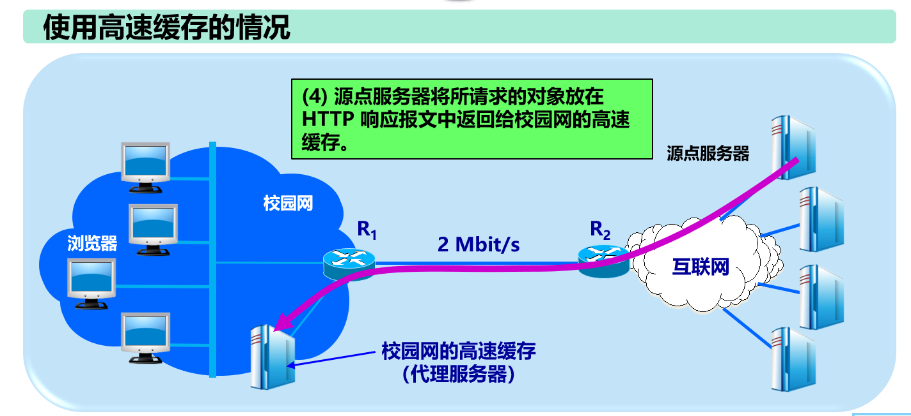

# 

# 小总结
## 互联网的组成
1. 边缘部分：主机
 1. C/S
 2. P2P
2. 核心部分：路由/交换机
 1. 电路交换
  - 方式：建立连接——通话——释放连接
  - 优点：资源专用，无共享
  - 缺点：计算机数据具有突发性，不适用，且平时通信链路的利用率很低
 2. 分组交换
  - 优点：
    1. 高效：在分组传输的过程中动态分配传输带宽，对通信链路是逐段占用
    2. 灵活：为每一个分组独立地选择最合适的转发路由
    3. 迅速：以分组作为传送单位，可以不先建立连接就能向其他主机发送分组
    4. 可靠：保证可靠性的网络协议；分布式多路由的分组交换网，使网络有很好的生存性
  - 缺点：
    1. 排队
    2. 延时
    3. 首部的开销
    4. 丢包
  3. 两者对比：
     1. 若要连续传送大量的数据，且其传送时间远大于连接建立时间，则电路交换的传输速率较快
     2. 由于一个分组的长度往往远小于整个报文的长度，因此分组交换比报文交换的时延小，同时也具有更好的灵活性
  4. 例题：
   - 

## 三级互联网结构
1. 主干网
2. 地区网
3. 校园网（企业网）

## 网络性能

- 以下说法是错误的：“在高速链路（或高带宽链路）上，比特会传送得更快些”
- 非性能指标：费用、可靠性、可扩展性和可升级性、标准化、易于管理、易维护性

## 网络类别

## 网络分层

# 链路层

## 基础术语：
 - 结点(nodes)
 - 链路(links)
 - 帧`(frame)`：链路层中的数据包，包含了网络层中的数据报`(datagram)`
 - 链路层负责从一个结点，通过一条链路，将数据传到物理相邻的另一个结点

## 数据链路层是非常重要的一层：
- 在网络中，无论是主机还是路由，都必须实现这一层，比如
 - 主机的五层结构：应用层、运输层、网络层、链路层、物理层
 - 路由的三层结构：网络层、链路层、物理层
 - 都实现了链路层这一结构
- 在局域网中，无论是主机还是交换机，也都必须实现链路层
 - 主机的五层结构：应用层、运输层、网络层、链路层、物理层
 - 交换机的两层结构：链路层、物理层
 - 也都实现了链路层这一结构

## 数据链路层的作用
- 假设有两台主机H1、H2在通信，两台主机间的数据可能经过多种不同的网络，比如：广域网、局域网、电话网
- 先看主机的数据流动，是从应用层开始，经过完整的五层协议，最后在信道上传输
- 数据到达路由器的时候，也得自底向上、自顶向下地传输
- 所以，当我们研究数据链路层的问题时，可以忽略其他的层，直接看数据在链路层上的流动
- **在只看链路层进行分析的时候，一定要注意，不同的网络，不同的结点之间，使用的有可能是不同的协议**

## 数据链路层传送的是帧
- 帧`(frame)`：链路层中的数据包，包含了网络层中的数据报`(datagram)`

## 链路层的实现
1. 实现为适配器的形式(adapter或者网卡NIC)或者在芯片上实现，往往同时包含链路层和物理层的实现
2. 适配器/NIC再接入到主机的系统主线

## 数据链路层的三个基本问题：

### 封装成帧：
- 在一段数据的前后加上首部和尾部，就构成了一个帧
- 接收端收到物理层上交的比特流后，根据首部和尾部的标记，识别帧的开始和结束
- 一个帧是链路层的数据传送单元
- 一个帧的帧长等于数据的长度加上首部和尾部的长度
- 首部和尾部的重要作用是帧定界（确定帧的界限）
- 每一种链路层协议都规定了所能传送的帧的数据部分长度上限——最大传送单元`MTU(Maximum Transfer Unit)`

### 透明传输*：

### 差错检测：
- 在传输过程中，可能因为信号放大、噪声等问题，导致比特出错
- 误码率：传输错误的比特占所传输比特总数的比率

#### 奇偶校验：
- 若数据中有奇数个1，则奇偶校验位为1

##### 单个位奇偶校验：
- 比如：`0111000110101011|0`是有差错的

##### 二维奇偶校验：
- 检测并更正单个位的错误（例子在计算机网络_2_链路层和局域网.ppt中）
- **注意，如果一个2X2的块中四个都出现了差错，那么将无法修改**

#### 循环冗余检验CRC：
- 数据为k个比特
- k个比特后面加上n个比特的供差错检验的冗余码

##### 冗余码的计算：
- 用k+n个比特的数，使用模2计算的方式，除以事先确定好的除数P(一个n+1位的数据)
- 每次得到一个余数R(一个n位的数据，比P少一位)
- 注意k+n的开头一定是1
- 最后将余数R作为冗余码，拼接在数据的后面
- P的选择由多项式决定，规则为：P的最高位和最低位必须为1，也就是说多项式一定有一个次数为P长度的项以及一个常数项，其他次数的项表示：次数对应P的位置上的数字是1
- 详细例子见计算机网络_2_链路层和局域网.ppt

##### 检验：
- 发送端从n个0开始，CRC后得一个R，拼接在数据的末尾
- 接收端利用末尾的n位，CRC后得一个余数R，R为0，则接收数据；R不为0，则丢弃数据

##### 循环冗余检验不能做到可靠传输的原因
- 比如接收报文的顺序，必须加上确认和重传机制（其他层协议负责）

# 广播信道、信道复用

## 链路层不同的“链路”新式
1. 点对点：专享信道，采用PPP协议
2. 广播形式：共享线路或者传输媒介
 - 多接入协议：
   - 原因：广播信道中，往往只有一条共享的信道，然而有两个或多个结点，可能发生同时的数据传输，产生冲突
   - 分布式算法：每个节点上决定是否应该发送信号
   - 何时可以发送信号
   - 注意，所有的协议通信用到的也是该广播信道自身

## 三类多接入协议

### 信道划分

#### TDMA(时分复用)
- 每个节点在每一轮都会获得定长的`时隙slot(源自用户发送的数据)`
- 每个节点在一定的时间产生一个`帧(frame)`，每一个帧存放固定数量的`slot`，`slot`按顺序添加
- 如果在某个时间节点，某个主机没有发送数据，那么它的`slot`位置将空闲
- 即使有用户在持续发送数据，也不可以使用这些空隙，所以造成了很大的浪费

#### STDMA(统计时分复用)
- 使用集中器，对TDMA进行改进
- 使用STDM帧来传送复用的数据，每个STDM帧的时隙数小于用户的数量
- 动态将数据添加进时隙，当一个帧满了就发送出去

#### FDMA(频分复用)
- 每个用户分配一个固定的频段
- 用户数量越大，所需的带宽就要越大

#### CDMA(码分复用)
- 将需要发送的信号通过不同的编码进行调制，然后复用广播信道

### 随机接入

#### Slotted ALOHA
- 基本假设：
 - 所有帧大小一致
 - 时间轴划分为等长的时隙，通常是传输一帧的时间
 - 节点均只在时隙开始的时候传输
 - 节点的行为是同步的
 - 如果超过两个节点在一个时隙同时传输，则所有节点能侦测到碰撞
- 操作
 - 当一个节点获得一个新的帧，则在下一个时隙开始的时候传输：
  - 如果没有碰撞，则传输成功，该节点成功传输了这个帧
  - 如果发生碰撞，则传输失败。该节点在以后的每一个时隙均以概率𝑝进行重传，直至传输成功
- 优点
 - 每个时隙中，都有一个节点可以一直以全速进行传输
 - 高度分布式算法：只需把所有节点的时隙进行同步即可，其余全部是通过节点自行探测解决
- 缺点
 - 碰撞，且浪费了很多时隙，也会有很多时隙是闲置的
 - 需要一个时隙去侦测碰撞的发生。但事实上节点可能只需要更少的时间就可以侦测碰撞
 - 需要时钟同步
- 效率
 - 设节点数N，每个节点在每个时隙成功发送的概率为p
 - 则“某个节点在某个时隙发送成功”的概率为：p(1-p)^(N-1)
 - 则“任意结点在某个时隙发送成功”的概率为：p0=N*p(1-p)^(N-1)
 - 求出，当p=1/N时，p0有最大值p0=(1-1/N)^(N-1)
 - 求Slotted ALOHA的最大效率，则对p0求极限（N->∞），极限为1/e，即36.8%

#### CSMA(Carrier Sense Mutiple Access)协议家族
- 发送数据前先监听广播信道，如果信道空闲，则发送整个帧；如果信道正忙，则延迟发送

##### 碰撞检测
- “碰撞检测”就是计算机边发送数据边检测信道上的信号电压大小。
- 当几个站同时在总线上发送数据时，总线上的信号电压摆动值将会增大（互相叠加）。
- 当一个站检测到的信号电压摆动值超过一定的门限值时，就认为总线上至少有两个站同时在发送数据，表明产生了碰撞。
- 所谓“碰撞”就是发生了冲突。因此“碰撞检测”也称为“冲突检测”。
- 在发生碰撞时，总线上传输的信号产生了严重的失真，无法从中恢复出有用的信息来。
- 每一个正在发送数据的站，一旦发现总线上出现了碰撞，就要立即停止发送，免得继续浪费网络资源，然后等待一段随机时间后再次发送。
- 最先发送数据帧的站，在发送数据帧后至多经过时间`2𝜏（两倍的端到端往返时延）`就可知道发送的数据帧是否遭受了碰撞。
- 以太网的端到端往返时延2𝜏称为争用期，或碰撞窗口。
- 经过争用期这段时间还没有检测到碰撞，才能肯定这次发送不会发生碰撞。
- 在10M bit/s的以太网中，传统取51.2𝜇𝑠为争用期的长度。对应在争用期内，可以发送512bit（64 byte）的数据
 - 即：若前64字节没有发生冲突，则该帧的后续数据不会发生冲突
 - 一半时间（25.6𝜇𝑠）对应着以太网的最大端到端的长度，约为5km（玻璃纤维中的信号传播速度约为200km/ms）

##### CSMA/CD算法
1. 网卡（NIC）从网络层收到数据报文，包装成帧
2. 如果NIC检测到信道空闲，则开始发送数据；反之，则等待直至信道空闲，然后发送数据
3. 如果网卡成功传输了整个帧，并没有遇到其他同时的传输，则该帧传输完成！
4. 如果NIC在发送帧的过程中检测到发生碰撞，则中止发送，并发送拥塞信号
5. 中止发送后，NIC进入二进制指数退避（binary exponential backoff）：
 - 基本退避时间为争用期2𝜏。
 - 若已经经过m次重传，则从整数集合{0,1,…,2^𝑚−1}中随机取出一个数，定为k。重传所需的时延即为k倍的争用期。
 - 重传16次仍不能成功，则丢弃该帧，并向更高层次的协议报告。
 - Truncated binary exponential backoff：经过m次重传后，整数集合选定为{0,1,…,2^(𝑚′ )−1}, 𝑚′=min⁡{𝑚, 10}.

### 受控接入

#### 轮询(polling)
- 主节点(master)邀请次节点(slave)轮流发送数据
- 缺点：
 1. 开销
 2. 延迟
 3. 单点故障（即主节点）

#### 令牌传递(token passing)
- 受控的令牌从一个节点依次序传递到下一个节点
- 有令牌的节点即可发送帧
- 缺点：
 1. 传递令牌的开销
 2. 延迟
 3. 单点故障（令牌本身）

# 链路层寻址

## MAC(Media Access Control)地址
- 48位，通常都烧录进NIC的ROM中，有时候也可以通过软件设定
- 注意：并不是一台电脑或者一台路由器/交换机只有一个MAC地址，MAC地址是和端口绑定的
- 前24位(3字节)——组织唯一标识符
- 后24位(3字节)——扩展唯一标识符

- 适配器从网络上每收到一个 MAC 帧就首先用硬件检查 MAC 帧中的 MAC 地址。
 - 如果是发往本站的帧则收下，然后再进行其他的处理。
 - 否则就将此帧丢弃，不再进行其他的处理。

- “发往本站的帧”包括以下三种帧： 
 - 单播 (unicast) 帧（一对一）
 - 广播 (broadcast) 帧（一对全体）
 - 多播 (multicast) 帧（一对多）

## NIC检查MAC地址
- 所有的适配器都至少能够识别前两种帧，即能够识别单播地址和广播地址。
- 有的适配器可用编程方法识别多播地址。
- 只有目的地址才能使用广播地址和多播地址。
- 以混杂方式 (promiscuous mode) 工作的以太网适配器只要“听到”有帧在以太网上传输就都接收下来。

## ARP(Adress Resolution Protocal)协议
- ARP表：局域网中的每个节点（主机、路由器等）都有一张表，称之为ARP表。
 - 存储了局域网中某些节点的IP地址/MAC地址的映射关系。
 - IP address; MAC address; TTL
 - TTL (time to live): 多久之后忘记该映射（典型值：20分钟）。

## ARP协议——同一局域网内
- A需要发送数据报给B
 - 假设A的ARP表中并没有B的MAC地址
 - 虽然A知道B的IP地址，在网络层A知道B的位置，但是链路层A并不知道
- A发送广播ARP查询packet，包含了B的IP地址
 - 该packet中的目的MAC地址是FF-FF-FF-FF-FF-FF（广播）
 - 局域网中所有节点都收到了该查询
- B收到该packet，将自身的MAC地址回复给A
 - 这个回复帧，发送给A的MAC地址（单播）
- A将学习到的IP-MAC地址映射存放在其ARP表中，直到该信息过时：
 - 除非更新信息，否则在TTL后该信息即为过时
- ARP协议是“即插即用”的：
 - 节点创建自己的ARP表格，并不需要网络管理员的人工干涉

## ARP协议——不在同一局域网内
- 过程基本相同，但需要分开先从边缘路由器跳转，获得各自的MAC地址

# 以太网

## 以太网的帧结构

|preamble|dest.address|source address|type|data|CRC|
|:---:|:---:|:---:|:---:|:---:|:---:|
|8 byte|MAC 6 byte|MAC 6 byte|2 byte|46~1500 byte|4 byte|

### preamble
- 由前7个重复的字节`10101010`和最后一个字节`10101011`组成
- 前7个字节为`前同步码`，用于MAC帧的比特同步
- 第8个字节为`帧界定符`，用于界定MAC帧的开始

### dest.address
- 6个字节的目标MAC地址

### source address
- 6个字节的源MAC地址

### type
- 2个字节的，用于告诉目标MAC收到该帧后，传输到上一层的何种协议

### data
- 数据字段的正式名称是`MAC客户数据字段`
- 最小长度64字节-18字节的首部和尾部=数据字段的最小长度(46字节)

### FCS(Frame Check Sequence)
- 4个字节的，加入了CRC冗余码的序列

### 无效帧
- 帧长度不是整数字节
- CRC校验失败
- data不在范围内
- MAC帧长度不在64~1518字节之间
- 直接丢弃，不再重传

# 交换机
- 在链路层扩展以太网，最常用的方法是使用交换机
- 交换机只有两层：物理层和链路层，因为交换机只负责将收到的帧从一个端口转向另一个端口，而不需要做更多复杂的事情
- 注意：交换机的每个接口都是一个碰撞域
 - 也就是说，不同的接口若是同时发送帧，将不会发生冲突 

## 交换机通过交换表查询可访问的接口
|主机的MAC地址|可以通过哪个接口访问|有效期|
|:---:|:---:|:---:|
||||
|||| 

## 自学习
- 交换机通过自学习实现交换表的更新余维护
- 当交换机收到一个帧时：
 - 记录主机MAC地址以及使用的端口
  - 如果表中有`des.address`的信息，那么将发送数据
  - 如果`des.address`==`source address`，丢弃帧
  - 如果没有，则广播

## 交换机毒化
- 通过发送大量的具有不同伪造源MAC地址的分组，因而用伪造表项填满了交换表，减少了合法主机的空间

# VLAN虚拟局域网
- 使用交换机可以构造VLAN，VLAN不会收到来自其他VLAN的信息
- 每个VLAN都是一个广播域

|方法|描述|缺点|
|:---:|:---:|:---:|
|基于交换机端口的方法|属于在第一层划分VLAN的方法|不便于移动|
|基于计算机网卡的MAC地址方法|属于在第二层划分VLAN|方便移动，但不便于维护|
|基于协议类型的方法|通过链路层帧的`type`来区分，属于第二层||
|基于IP子网地址的方法|根据以太网帧的第三个字段“类型”字段和IP分组首部中的源 IP 地址字段来区分，属于第三层||
|基于高层应用或服务的方法|||

## VLAN使用的以太网帧格式
- 802.3ac定义了以太网帧格式的扩展
- 即在`source address`后插入一个4字节的`802.1Q`标记，用来指明该帧来自于哪个局域网

# 网络层向运输层提供“无连接的、尽最大努力的”数据报服务
- 无连接即网络层发送分组时不需要先建立链接
- 同时，网络层不提供质量服务承诺
- 如果主机之间需要建立可靠的链接，那么就交由运输层负责

# 网络层的重要作用
1. 转发：将分组从路由器的输入端口转发到合适的输出端口
2. 路由：决定分组从发送端到接收端的的具体路径

# 数据平面和控制平面
- 数据平面：
 - 本地、基于单个路由器的行为
 - 主要行为：转发

- 控制平面：
 - Network-wide的行为
 - 主要行为：路由
 - 两种控制平面的路由做法：
   - 传统的路由算法：在每个路由器上运行路由算法，决定分组的路由
   - SDN（软件定义网络Software-defined Networking）：在 中心服务器上定义路由算法。

- 也就是说，一个路由叫数据平面，多个路由叫控制平面

## 传统路由方法
- 每一个路由器上都要布置路由算法，这些路由算法组成了控制平面

## SDN的路由
- 和传统路由不同，控制平面不是部署在每个路由器中的，而是逻辑上中心化的。
- 控制平面往往并不需要和数据平面部署在一起。
- 路由器中不再部署算法，只是控制平面的代理/中介。
- 举个例子：一个远程的控制平面，控制若干个没有布置路由算法的路由（数据平面），这些数据平面将根据控制平面来进行转发的行为

# IP协议

## IP地址
- IP 地址就是给每个连接在互联网上的主机（或路由器）分配一个在全世界范围是唯一的 32 位的标识符
 - 一般用形如X.X.X.X的方式表示，每个X对应8位的二进制数

### 编址方法
#### 分类IP地址
- 将IP地址划分为若干个固定类
- 每一类地址都由两个固定长度的字段组成：
 - 网络号(net-id)：标志主机（或路由器）所连接的网络
 - 主机号(host-id)：标志该主机（或路由器）
 - 主机号在它前面的网络号范围内必须是唯一的
- IP地址::={(net-id)(host-id)}

|地址类别|net-id长度|host-id长度|补充|
|:---:|:---:|:---:|:---:|
|A类地址|8bit|24bit|最高位必须为0|
|B类地址|16bit|16bit|最高位必须为10|
|C类地址|24bit|8bit|最高位必须为110|
|D类地址|||多播地址，前四位必须为1110|
|E类地址|||保留地址，无实际作用，前四位必须为1111|

- net-id不可以全0全1，因为没有意义，所以在计算范围大小的时候我们要减去这两种情况
|网络类型|最大可指派的网络数|第一个可指派的网络号|最后一个可指派的网络号|每个网络中最大的主机数|
|:---:|:---:|:---:|:---:|:---:|
|A|126(2^7-2)|1|126|16777214|
|B|16383(2^14-1)|128.1|191.255|65534|
|C|2097151(2^21-1)|192.0.1|223.255.255|254|

- 一般不使用的特殊的ip地址
|网络号|主机号|源地址使用|目的地址使用|代表的意思|
|:---:|:---:|:---:|:---:|:---:|
|0|0|可以|不可|在本网络上的本主机(用于DHCP协议)|
|0|host-id|可以|不可|在本网络上的某台主机|
|全1|全1|不可|可以|旨在本网络上进行广播|
|net-id|全1|不可|可以|对net-id上的所有主机进行广播|
|127|非全0或全1的任何数|可以|可以|用于本地软件环回测试|

- 全0和全1在分类IP编码方法中通常是不计的

#### 子网划分
- 见PPT

#### 无分类编址（CIDR）
- 见PPT

- 对“IP地址是否连续分配给了各系”的思考：
- 首先，答案是连续地分配了
 - 我们先看大学X的地址206.0.68.0/22，二进制表示为11001110.00000000.010001*，这里表示这个大学一共有2^10个地址可以进行分配
 - 我们再看一系的地址206.0.68.0/23，二进制表示为11001110.00000000.0100010*，这里表示一系一共有2^9个地址可以分配
   - 我们再看206.0.68.0/23的地址块，它是从11001110.00000000.01000100.00000000开始，一直到11001110.00000000.01000101.11111111的，先记住这一点
 - 我们再看二系的地址206.0.70.0/24，二进制表示为11001110.00000000.01000110.*，这里表示二系一共有2^8个地址可以分配
   - 我们再看206.0.70.0/24的地址块，它是从11001110.00000000.01000110.00000000开始，一直到11001110.00000000.01000110.11111111的
   - 现在，比较这个范围和一系的范围，发现了
     - 一系：11001110.00000000.01000100.00000000-11001110.00000000.01000101.11111111
     - 二系：11001110.00000000.01000110.00000000-11001110.00000000.01000110.11111111
     - 一系最大地址加1，即二系最小地址
     - 所以是连续分配的

## IP数据报格式+分片与重组
- 一个IP数据报由首部和数据两部分组成
- 首部的前一部分（不包括可选字段和填充部分）是固定长度，共20字节
- 在首部的固定部分后面是可选字段，其长度是可变的
 - 所以首部有一个首部长度的部分，就是因为可选字段的存在

### IP数据报的固定部分
- 这一部分的长度是固定的，共20字节，每一个IP数据报都会有的

#### 版本
- 共4bit，绝大多数都为IPv4

#### 首部长度
- 共4bit，可以表示0-15的数字，即表示5-15个单位：
 - 单位：一个单位为4byte
  - 因为首部的固定部分为20byte，即5个单位，所以首部长度应该从5开始
  - 因为首部长度最大为15个单位，所以首部长度最大为60byte

#### 区分服务
- 共8bit，用来获得更好的服务
- 在旧标准中叫做服务类型
- 只有在使用区分服务时(DiffSery)时，这个字段才起作用，否则一般不起作用

#### 总长度
- 占16bit，包括首部和数据之和的长度
- 因此数据报的最大长度为2^16-1=65535字节
- 总长度不得超过最大传送单元MTU
 - 最大传输单元（Maximum Transmission Unit，MTU）：用来通知对方所能接受数据服务单元的最大尺寸，说明发送方能够接受的有效载荷大小。

#### 标识
- 占16bit，它是一个计数器，用于产生IP数据报的标识
- IP 协议在存储器中维持一个计数器。每产生一个数据报，计数器就加 1，并将此值赋给标识字段。
- 当数据报的长度超过网络的 MTU，而必须分片时，这个标识字段的值就被复制到所有的数据报的标识字段中。具有相同的标识字段值的分片报文会被重组成原来的数据报。

#### 标志
- 占3bit，目前只有后两位有意义
- 标志字段的最低位是MF(More Fragment)，当该位为1时表示后面还有分片
- 标志字段的中间一位是DF(Don't Fragment)，只有当DF为0时才可以分片
 - 因为链路层帧的数据长度只有46~1500byte，而IP数据报的数据长度最长可达65535-60=65475byte，所以一个很长的IP数据报到了链路层将会被分片
 - 比如：
  - 一个3820byte的数据报，需要分片长度不超过1420byte的分片
  - 那么久将20byte的首部复制3遍，再将3800byte的数据分为1400byte,1400byte,1000byte的3个分片
  - 每个分片再加上20byte的首部，但必须修改有关字段的值

#### 偏移量
- 用于标记分片处于原来的数据报的位置
- 比如上面举的例子
 - 第一个1400byte的分片的偏移量为0/8=0byte
 - 第二个1400byte的分片的偏移量为1400/8=175byte，即表示这部分从原来报文的第175byte开始
 - 第三个1400byte的分片的偏移量为2800/8=350byte，即表示这部分从原来报文的第350byte开始

- IP数据报首部中与分片有关的字段中的值
||总长度|标识|DF|MF|偏移量|
|:---:|:---:|:---:|:---:|:---:|:---:|
|原始数据报|3820|12345|0|0|0|
|分片1|1420|12345|0|1|0|
|分片2|1420|12345|0|1|175|
|分片3|1020|12345|0|0|350|

#### 生存时间
- 占8bit，记为TTL(Time To Live)，指示数据报在网络中可通过的路由器数的最大值

#### 协议
- 占8bit，指出此数据报携带的数据使用何种协议，以便IP层将数据上交给那个协议处理

#### 首部检验和
- 占16bit，只检验数据报的首部，不检验数据部分
- 操作流程：
 1. 将检验和置为全0
 2. 将首部的所有内容以16byte的方式分组，不管它属于哪部分
 3. 将所有分组取反，求和，再取反
   - 若在求和的任一过程中求到的结果多一位（即最高位多一个1），那么将这个1去掉，整个结果再加1（也可以理解为把这个1移到了末尾相加）
   - 比如1110 0110 0110 0110 + 1101 0101 0101 0101 得到的和是 （进位1）后面跟着1011 1011 1011 1011，所以最后的sum是1011 1011 1011 1100，所以checksum是0100 0100 0100 0011
 4. 最后得到一个16bit的检验和

- 检验流程：
 1. 和前面一样，以16byte为分组
 2. 全部取反，相加，再取反
 3. 若最后得到的结果为全0，则保留

#### 源地址，目的地址
- 都为32bit的IP地址

#### 可变部分
- IP 首部的可变部分就是一个选项字段，用来支持排错、测量以及安全等措施，内容很丰富
- 选项字段的长度可变，从 1 个字节到 40 个字节不等，取决于所选择的项目。
- 增加首部的可变部分是为了增加 IP 数据报的功能，但这同时也使得 IP 数据报的首部长度成为可变的。这就增加了每一个路由器处理数据报的开销。

## NAT(Network Address Translation)
- 当使用NAT的时候，我们所知道的IP地址唯一就显得没有特别的必要了
- 因为ISP可以认为，某一个地址代表了多台主机
 - 举个例子，ISP知道你家的路由器的IP地址，但是不需要知道和路由器相连的设备的IP地址
 - 也就是说，这个路由器代表了所有与之相连的主机

- 使用NAT时，通常有两个特性
 1. 透明性
   - 可以更改本地设备的IP地址而不需要通知外部世界
   - 可以更改ISP而不需要更改本地的IP地址
 2. 安全性
   - 本地网络内的设备不能直接被外部世界的设备访问

### 本地地址、全球地址、专用地址
- 本地地址：
 - 仅在机构内使用的IP地址，不需要向ISP申请
- 全球地址：
 - 全球唯一的IP，很牛逼，稀缺资源，必须申请

- 专用地址(private address)：
 - 为了解决本地地址和全球地址的二义性问题提出的
 - 专用地址只表示本地地址，当路由器接收到一个发往专用地址的数据报，一律不进行转发

 - 三个专用地址的地址块
 1. 10.0.0.0到10.255.255.255
   - A类，又记为10.0.0.0/8，它又称为24位块
 2. 172.16.0.0到172.31.255.255
   - B类，又记为172.16.0.0/12，它又称为20位块
 3. 192.168.0.0到192.168.255.255
   - C类，又记为192.168.0.0/16，它又记为16位块

### NAT的两种实现方式

#### NAT(纯粹的地址转换)
- 举个例子
 - 假设专用网(192.168.0.0)中的主机A(192.168.0.3)向外界的主机B(213.18.2.4)发送数据，中间经过路由(172.38.1.5)
 - 那么数据报一开始的目的地址就为路由的172.38.1.5
 - 路由接受到数据报后，将源地址改为自己的172.38.1.5，并且将路由表更新，记录192.168.0.3->213.18.2.4的信息
 - 主机B接受到数据报，发回反馈，目的地址为路由的172.38.1.5
 - 路由接收到主机B的数据报，根据路由表，将数据报的目的地址改为192.168.0.3，并发回主机A
- 那么问题就在：
 - 若路由连接多台主机，多台主机同时发送数据，那么仅有1个全球IP地址的路由是不够用的，排队使用显然也很不现实
 - 而且若路由表内无信息，那么外界是无法访问专用网内的主机的，也就是说专用网内的主机不可以作为服务器使用

#### NAPT(Network Address and Port Translation)
- 利用地址和端口进行转换
- NAT路由器只需要具有一个全球IP地址就足够了。不通过IP地址来区分不同的本地、源IP地址，而通过NAT路由器上的端口号来区别。
 - 其实就是利用端口表示n个IP地址
- 操作基本是一样的，注意每次发送和接受都要带上端口号

## IPv6
- IPv6仍然支持无连接的传送
- IPv6和IPv4的主要区别是：
1. 更大的地址空间。IPv6 将地址从 IPv4 的 32 位 增大到了 128 位。 
2. 扩展的地址层次结构。 
3. 灵活的首部格式。 IPv6 定义了许多可选的扩展首部。
4. 改进的选项。 IPv6 允许数据报包含有选项的控制信息，其选项放在有效载荷中。
5. 允许协议继续扩充。 
6. 支持即插即用（即自动配置）。因此 IPv6 不需要使用 DHCP。
7. 支持资源的预分配。  IPv6 支持实时视像等要求，保证一定的带宽和时延的应用。
8. IPv6 首部改为 8 字节对齐。首部长度必须是 8 字节的整数倍。原来的 IPv4 首部是 4 字节对齐。

### IPv6数据报的一般形式
- IPv6数据报由两大部分组成
1. 基本首部
2. 有效载荷。有效载荷允许由零个或多个扩展首部，再后面是数据部分

#### 基本首部
- 版本（4位）：IPv4总是对应4，IPv6总是对应6
- 通信量类（8位）：为了区分不同的IPv6数据报的类别或优先级
- 流标号（20位）：“流”是互联网络上从特定源点到特定终点的一系列数据报， “流”所经过的路径上的路由器都保证指明的服务质量。所有属于同一个流的数据报都具有同样的流标号。 
- 有效载荷长度（16位）：指明IPv6数据报除了基本首部之外的字节数，最大为64KB
- 下一个首部（8位）：相当于IPv4的协议字段或可选字段
- 跳数限制（8位）：源站在数据报发出时即设定跳数限制。路由器在转发数据报时将跳数限制字段中的值减 1。当跳数限制的值为零时，就要将此数据报丢弃。 
- 源地址
- 目的地址

#### 扩展首部
- IPv6 把原来 IPv4 首部中选项的功能都放在扩展首部中，并将扩展首部留给路径两端的源站和目的站的主机来处理。
- 数据报途中经过的路由器都不处理这些扩展首部（只有一个首部例外，即逐跳选项扩展首部）。
- 这样就大大提高了路由器的处理效率。 

### IPv6的地址
- IPv6采用冒号16进制记法，支持零压缩，支持CIDR的斜线表示法
#### IPv6的地址分类
|地址类型|二进制前缀|冒号16进制记法|
|:---:|:---:|:---:|
|未指明地址|全0|::/128|
|环回地址|00...1/128|::1/128|
|多播地址|11111111(8位)|FF00::/8|
|本地链路单播地址|1111111010(10位)|FE80::/10|
|全球单播地址|（除上述四种外，所有其他的二进制前缀）||

#### IPv6的目的地址
1. 单播
2. 多播
3. 任播：这是 IPv6 增加的一种类型。任播的目的站是一组计算机，但数据报在交付时只交付其中的一个，通常是距离最近的一个。 

#### 向IPv6过渡的策略
1. 使用双协议栈：一台主机（或路由器）装有两个协议栈，根据 DNS 返回的地址类型可以确定使用 IPv4 地址还是 IPv6 地址
2. 使用隧道技术：当IPv6数据报进入IPv4网络时，先将IPv6数据报封装成IPv4数据报

# 路由协议-基本概念、术语
## 分层次的路由选择协议
### 自治系统(AS)
- 定义：在单一的技术管理下的一组路由器，而这些路由器使用一种 AS 内部的路由选择协议和共同的度量以确定分组在该 AS 内的路由，同时还使用一种 AS 之间的路由选择协议用以确定分组在 AS之间的路由。
- 重要的是一个 AS 对其他 AS 表现出的是一个单一的和一致的路由选择策略。
### 路由选择协议
- 内部网关协议IGP(Interior Gateway Protocol)
 1. 在一个AS内部使用的路由选择协议
 2. 如RIP和OSPF协议
- 外部网关协议EGP(External Gateway Protocol)
  1. 若源站和目的站处在不同的自治系统中，当数据报传到一个自治系统的边界时，就需要使用一种协议将路由选择信息传递到另一个自治系统中。这样的协议就是外部网关协议 EGP。
  2. 在外部网关协议中目前使用最多的是 BGP-4

- 自治系统之间的路由选择也叫做域间路由选择 (inter-domain routing)，在自治系统内部的路由选择叫做域内路由选择 (intra-domain routing) 。

## 两类基本路由算法
### Dijistra算法
- 时间复杂度：O(n^2)
- 可以做到：O(nlogn)
### 距离向量算法
- Bellman-Ford等式
  1. 用𝐷_𝑥 (𝑦)表示“从x到y的最佳路径的成本”
  2. 则有𝐷_𝑥 (𝑦)=   min┬𝑣⁡〖{𝑐(𝑥,𝑣)+𝐷_𝑣 (𝑦)}〗
  3. “x到v的成本”+“从v到y的最佳路径的成本”
- 其他见课件计算机网络_4_网络层-控制平面
- 注意，每个路由器的距离向量表发生变化时，都要向相邻的路由器发送这种变化，时间长以后，估计可以收敛到真实值

- 两个特点：
1. “好消息传得快”：
 - 这个很好理解，就是说一个路由器的距离向量变小的时候，将新的距离向量发送给邻居，邻居更新自己的距离向量表，这样在下一次传送报文的时候可以选择距离最短的路径
2. “坏消息传得慢”：
  - 这个需要结合PPT上的图进行理解
  - 总的来说，当某两个路由器之间的距离变大的时候，在发送这种更新的时候，容易产生路由环路（即x->y->z,z->y->x）
  - 并且由于距离向量表是根据其他路由器发送的表来进行维护的，所以这种错误就有可能传遍整个网络
3. 避免路由环路的方法：
- 毒性逆转，比如当z->y->x的时候，z向下一个路由器通告Dz(x)=∞，防止报文重新经过y到达x

### Dijstra算法 VS 距离向量算法
1. 消息的复杂度
  1. Dijstra
     - n个结点，E条链路，则需要O(nE)条消息
  2. 距离向量算法
     - 消息只在相邻结点之间传播，数目不定
2. 收敛速度
  1. Dijstra
     - O(n^2)
  2. 距离向量算法
     - 收敛时间不定，存在路由环路，无穷计数问题
3. 健壮性
  1. Dijstra
     - 节点可能会广播错误的链路成本
     - 每个路由器只维护自己的转发表
  2. 距离向量算法
     - 节点可能会广播错误的路径成本
     - 因为转发表是依靠其他路由器所发的转发表进行维护的，所以错误会在网络中逐渐传播

## 内部网关协议、外部网关协议
### 内部网关协议
#### 路由信息协议RIP(Routing Information Protocol)
- RIP基于距离向量算法
- RIP 协议要求网络中的每一个路由器都要维护从它自己到其他每一个目的网络的距离记录。 
##### 距离的定义
- 一个路由器到直接连接的网络的距离为1
- 一个路由器到非直接连接的网络的距离为所经过的路由器数加1
- 每经过一个路由器，距离加1
- RIP允许一条路径最多只能包含15个路由器
- RIP不能在两个网络之间同时使用多条路由。RIP选择一个具有最少路由器的路由，哪怕还存在另一条高速（低时延）但路由器较多的路由
##### RIP的特点
1. 仅和相邻路由器交换信息
2. 交换的信息是当前本路由器所知道的全部信息，即自己的路由表
3. 按固定的时间交换路由信息
##### 路由表的建立
1. 首先，路由器只知道和自己距离为1的路由器，它的路由表是空的
2. 以后，路由器也只跟数目非常有限的相邻路由器交换并更新路由表
3. 最后，每个路由器都会知道在本自治系统中到达任意一个路由器的最短路径
4. RIP协议的“收敛”速度比较快。“收敛”即指在自治系统中所有的节点都得到正确的路由选择信息的过程
##### RIP中的距离向量算法
- 以路由器收到相邻路由器X的RIP报文为例子
1. 先修改此RIP报文中的所有项目：
  - 把“下一跳”字段中全部改为路由器，并把所有“距离”字段的值加1
2. 对修改后的RIP报文中的每一个项目，重复以下步骤：
  - 若项目中没有出现目的网络，则把该目的网络和距离添加到路由表中（注意这里添加的是修改版）
  - 若下一条字段给出的路由器地址是同样的X，则把收到的项目替换原路由表中的项目
  - 若下一条字段中给出的路由器地址不同于X，则比较旧距离和新距离的大小，谁小留谁
3. 若3分钟还没有收到相邻路由器的更新路由表，则把此路由器记为不可达路由器，将距离设置为16
4. 返回
- 这里先要修改报文，是根据距离向量算法的原理，更新的是通过路由器X，到目标网络的距离向量
##### RIP2协议报文的格式
###### 首部
- 共4字节
|命令|版本|必为0|
###### 路由部分
- 由若干个路由信息组成，每个路由信息都需要20字节
- 地址族标识符用来标志所使用的协议
- 路由标记填入自治系统的号码，这是考虑使RIP有可能收到本自治系统以外的路由选择信息
- 一个RIP报文最多可包含25个路由，所以RIP报文的最大长度是4+20*25=504字节
|地址族标识符|路由标记|
|:---:|:---:|
|网络地址|
|子网掩码|
|下一跳路由器地址|
|距离（1-16）|
###### IP数据报
|IP首部|UDP首部|RIP报文|
|:---:|:---:|:---:|
- UDP用户数据报由UDP首部和RIP报文组成
##### RIP2的鉴别功能
1. 若使用鉴别功能，则将放第一个路由信息的位置用作鉴别
2. 在鉴别数据之后才写入路由信息，此时RIP路由表最多放入24个路由器的信息
##### RIP的优缺点
- 优点：实现简单，开销较小
- 缺点：
  1. RIP限制了网络规模，因为它的最大距离为16
  2. 路由器之间交换的是完整的路由表，随着网络规模的扩大，开销也增大
  3. “坏消息传得慢”

#### 开放最短路径优先OSPF(Open Shortest Path First)
- OSPF采用分布式的链路状态协议
##### OSPF三个要点
1. 向本自治系统中所有的路由器发送信息，使用的是洪泛法
2. 发送的信息就是与本路由器相邻的所有路由器的链路状态，但这只是路由器所知道的部分信息
  - “链路状态”就是说明本路由器都和那些路由器相邻，以及该链路的“度量”
3. 只有当链路状态发生变化时，路由器才用洪泛法向所有路由器发送此信息
##### OSPF的区域
- 为了使OSPF应用于大规模网络，OSPF将一个自治系统再划分为若干个更小的范围，叫做区域
- 每一个区域都有一个32位的区域标识符（点分十进制表示）
- 一个区域的路由器最好不超过200个
- 上层的区域叫做主干区域，标识符位0.0.0.0，用来连通其他在下层的区域
- 主干区域中的路由器分为：
  1. 主干路由器
  2. 区域边界路由器：即和下层区域
- 优点：
  1. 洪泛时，只需要在区域内部进行而不需要整个网络进行
  2. 路由器只知道本区域内的网络拓扑，而不知道整个网络的
##### OSPF直接使用IP数据报传送
- OSPF构成的数据很短，不需要分片
- 而且分片只要丢失一个就必须整个重传
##### OSPF的其他特点
- 根据IP分组的不同服务类型而设置不同的代价。因此，OSPF对于不同类型的业务可计算出不同的路由
- 如果到同一个目的网络有多条相同代价的路径，那么可以将进行多路径的负载均衡
- 所有在OSPF路由器之间交换的分组都具有鉴别的功能
- 支持可变长度的子网划分和CIDR
- 每一个链路状态都带上一个 32 位的序号，序号越大状态就越新。
- OSPF 还规定每隔一段时间，如 30 分钟，要刷新一次数据库中的链路状态。 
- 由于一个路由器的链路状态只涉及到与相邻路由器的连通状态，因而与整个互联网的规模并无直接关系。因此当互联网规模很大时，OSPF  协议要比距离向量协议 RIP 好得多。 
- OSPF 没有“坏消息传播得慢”的问题，据统计，其响应网络变化的时间小于 100 ms。 

##### OSPF的五种分类类型
- 类型1，问候 (Hello) 分组。
- 类型2，数据库描述 (Database Description) 分组。
- 类型3，链路状态请求 (Link State Request) 分组。
- 类型4，链路状态更新 (Link State Update) 分组，用洪泛法对全网更新链路状态。
- 类型5，链路状态确认 (Link State Acknowledgment)分组。

#### RIP和OSPF的对比
|属性|RIP|OSPF|
|:---:|:---:|:---:|
|算法类型|距离向量|链路状态|
|具体算法|BellmanFord|Dijkstra|
|收敛速度|慢|快|
|适用网络大小|小规模或中等规模|都可|
|设备资源占用|CPU/内存占用较小|较大|
|网络资源占用|占用较大带宽（发送DV、转发表等）|较小（只需要发送较小的update）|
|度量|跳数|基于带宽|
|网络设计|平面网络|支持层次结构|
|基于协议|UDP（port:20）|IP(port:89)|

### 外部网关协议
#### 边界网关协议BGP(Border Gateway Protocol)
- 基础：BGP力求寻找一条能够达到目的网络且比较好的路由，而并非要寻找一条最佳路由
##### BGP发言人
- 一个 BGP 发言人与其他自治系统中的 BGP 发言人要交换路由信息，就要先建立 TCP 连接，然后在此连接上交换 BGP 报文以建立 BGP 会话(session)，利用 BGP 会话交换路由信息。
- 使用 TCP 连接能提供可靠的服务，也简化了路由选择协议。
- 使用 TCP 连接交换路由信息的两个 BGP 发言人，彼此成为对方的邻站(neighbor)或对等站(peer) 
##### BGP协议的特点
- BGP 协议交换路由信息的结点数量级是自治系统数的量级，这要比这些自治系统中的网络数少很多。
- 每一个自治系统中 BGP 发言人（或边界路由器）的数目是很少的。这样就使得自治系统之间的路由选择不致过分复杂。 
- BGP 支持 CIDR，因此 BGP 的路由表也就应当包括目的网络前缀、下一跳路由器，以及到达该目的网络所要经过的各个自治系统序列。
- 在 BGP 刚刚运行时，BGP 的邻站是交换整个的 BGP 路由表。但以后只需要在发生变化时更新有变化的部分。这样做对节省网络带宽和减少路由器的处理开销都有好处。 
##### BGP四种报文
- 打开 (OPEN) 报文，用来与相邻的另一个BGP发言人建立关系。
- 更新 (UPDATE) 报文，用来发送某一路由的信息，以及列出要撤消的多条路由。
- 保活 (KEEPALIVE) 报文，用来确认打开报文和周期性地证实邻站关系。
- 通知 (NOTIFICATION) 报文，用来发送检测到的差错。

## ICMP（网际控制报文协议）
- 基础：ICMP 允许主机或路由器报告差错情况和提供有关异常情况的报告。
### ICMP报文的种类
- ICMP 报文的种类有两种，即 ICMP 差错报告报文和 ICMP 询问报文。 
- ICMP 报文的前 4 个字节是统一的格式，共有三个字段：即类型、代码和检验和。接着的 4 个字节的内容与 ICMP 的类型有关。 
#### ICMP差错报文
- 终点不可达 
- 时间超过 
- 参数问题 
- 改变路由（重定向）(Redirect) 
- 差错报文的产生方式是截取一段IP数据报并对其中的内容进行修改的
- 不应发送差错报文的几种情况
  1. 对 ICMP 差错报告报文不再发送 ICMP 差错报告报文。
  2. 对第一个分片的数据报片的所有后续数据报片都不发送 ICMP 差错报告报文。
  3. 对具有多播地址的数据报都不发送 ICMP 差错报告报文。
  4. 对具有特殊地址（如127.0.0.0 或 0.0.0.0）的数据报不发送 ICMP 差错报告报文。
#### ICMP询问报文
- 回送请求和回答报文
- 时间戳请求和回答报文
#### PING
- ICMP应用的经典例子，结合实验进行学习
- PING 用来测试两个主机之间的连通性。
- PING 使用了 ICMP 回送请求与回送回答报文。
- PING 是应用层直接使用网络层 ICMP 的例子，它没有通过运输层的 TCP 或UDP。 
#### Traceroute
- windows指令`tracert`，用于跟踪一个分组从源点到终点的路径
- 原理：利用TTL字段和ICMP时间超过差错报告报文实现对从源点到终点的路径的跟踪。（主要理解如何利用TTL）
- TTL从1开始，一直到本机收到目的地址的回复或者收到不可达信息，这样就可以一直得到路径上的路由器的回复从而知道地址

## MPLS(Multi-Protocol Label Switching)
- “多协议”表示在 MPLS 的上层可以采用多种协议，例如：IP，IPX；可以使用多种数据链路层协议，例如：PPP，以太网，ATM 等。
- “标记”是指每个分组被打上一个标记，根据该标记对分组进行转发
- 为了实现交换，可以利用面向连接的概念，使每个分组携带一个叫做标记 (label) 的小整数。当分组到达交换机（即标记交换路由器）时，交换机读取分组的标记，并用标记值来检索分组转发表。 这样就比查找路由表来转发分组要快得多。
### MPLS的三个特点
1. 支持面向连接的服务质量；
2. 支持流量工程，平衡网络负载；
3. 有效地支持虚拟专用网 VPN。
### IP分组的转发
- 遵循“最长前缀匹配”原则（因为前缀越长，所指向的地址越清晰）
### MPLS的基本工作流程
1. MPLS 域中的各 LSR 使用专门的标记分配协议 LDP 交换报文，并找出标记交换路径 LSP。各 LSR 根据这些路径构造出分组转发表。 
2. 分组进入到 MPLS 域时， MPLS 入口结点把分组打上标记，并按照转发表将分组转发给下一个 LSR。给 IP 数据报打标记的过程叫做分类 (classification)。
3. 一个标记仅仅在两个标记交换路由器 LSR 之间才有意义。分组每经过一个 LSR，LSR 就要做两件事：一是转发，二是更换新的标记，即把入标记更换成为出标记。这就叫做标记对换 (label swapping)。
4. 当分组离开 MPLS 域时，MPLS 出口结点把分组的标记去除。再以后就按照一般分组的转发方法进行转发。
### 转发等价类FEC
- “转发等价类”就是路由器按照同样方式对待的分组的集合。 
- “按照同样方式对待”表示：从同样接口转发到同样的下一跳地址，并且具有同样服务类别和同样丢弃优先级等。
- 将属于同样 FEC 的分组都指派同样的标记。
- FEC 和标记是一一对应的关系。
- 由网络管理员控制
### MPLS首部
1. 标记值（占 20 位）。可以同时容纳高达 2^20 个流（即 1048576 个流）。实际上几乎没有哪个 MPLS 实例会使用很大数目的流，因为通常需要管理员人工管理和设置每条交换路径。
2. 试验（占 3 位）。目前保留用作试验。
3. 栈S（占 1 位）。在有“标记栈”时使用。
4. 生存时间TTL（占 8 位）。用来防止 MPLS 分组在 MPLS 域中兜圈子。

# TCP协议
## 端口
- 端口用一个16位端口号进行标志，允许有65535个不同的端口号
- 端口号只具有本地意义
- 端口号只是为了标志本计算机应用层中的各进程
- 两台加算计进行通信，不仅需要知道对方的端口号，还要知道IP地址
*使用端口的意义在于：进程在通信的时候是没有办法识别对方机器上的进程的，而端口就像是一个指引，指引运输层的协议把报文通过端口交到对应的应用进程手上，而端口就是“进程标识符”*
### 两大类端口
#### 服务器端使用的端口号
1. 熟知端口，更加常用，数值一般为0-1023（应该是1-1023，因为端口号0无意义）
2. 登记端口号，不常用，数值为1024-49151，为没有熟知端口号的应用程序使用的。使用这个范围的端口号必须在IANA登记，以防止重复
#### 客户端使用的端口号
1. 短暂端口号，数值为49152-65535，留给客户进程选择暂时使用
  - （客户端使用端口号是一个短暂的过程）
2. 当服务器进程接收到客户进程的报文时，就知道了客户进程所使用额动态端口号。通信结束后，这个端口号可供其他客户进程以后使用

- 应用层中的应用进程通过端口向运输层发送报文
- 运输层提供应用进程间的逻辑通信

- 网络层是为主机之间提供通信
- 运输层是为应用进程间提供通信
- 这也解释了图片下面部分的范围划分

- 复用：把来自不同端口的报文，都集中在TCP或UDP中
- 分用：把来自运输层的报文，通过不同的端口提交到相应的应用进程中

- 可靠与不可靠的界定，就是协议是否保证数据发送到了对方手里

## UDP协议
- UDP只在IP的数据报服务之上增加可很少一点的功能：
  1. 复用和分用的功能
  2. 差错检测的功能
### UDP的主要特点
1. UDP是无连接的
2. UDP使用尽最大努力交付
3. UDP是面向报文的
  - UDP对应用层交下来的报文，既不合并，也不拆分，而是保留这些报文的边界。UDP一次交付一个完整的报文
  - 而IP则是面向连接的，因为IP协议需要将报文分成大小合适的片，然后将这些片在链路层中传输，链路层帧是有大小限制的
  - 面向报文就是不对报文做分片，也不管链路中的冲突，应用层交多大的报文，UDP照样传送
    - 应用程序必须选择合适大小的报文
      1. 若报文太长，则IP层会分片，降低IP层的效率
      2. 若报文太短，IP数据报的首部的相对长度太大，这也降低了IP层的效率
    - 应用程序向UDP交数据报后
      1. UDP加上UDP首部，再交给IP层
      2. IP层加上IP层首部，交给链路层
4. UDP没有拥塞控制
  - 只有可靠连接的协议才可以进行拥塞控制
5. UDP支持一对一、一对多、多对一和多对多的交互通信
6. UDP的首部开销小
 - 只有8个字节，比TCP的20个字节的首部要短。

- 应用层向下提交报文到UDP->UDP加上首部，并交给网络层的IP->IP加上IP首部形成IP数据报

- 这张图表示了在协议栈中UDP的工作方式

### UDP的首部格式
- 8个字节
- 源端口：目的端口：长度：检验和（都是2字节）

#### 伪首部
- 用于计算检验和
- 共12字节
- 源IP地址(4)：目的IP地址(4)：0(1)：17(1)：UDP长度(2)
#### 检验和
- 每两个字节做反码运算求和

- 这里要注意，伪首部不是UDP报文的首部
- 伪首部仅仅只是为了计算校验和

## TCP最主要的特点
- TCP是面向连接的运输层协议
- 在无连接的、不可靠的IP网络服务基础之上，提供可靠的网络交付服务
- 每一条TCP连接只能有两个端点，每一条TCP连接只能是点对点的
- TCP提供可靠交付的服务
- TCP提供全双工通信
- 面向字节流
  1. TCP中的“流”指的是流入或流出进程的字节序列
  2. “面向字节流”的含义是：虽然应用程序和TCP的交互是一次一个数据块，但TCP把应用程序交下来的数据看成仅仅是一连串无结构的字节流
  3. TCP 不保证接收方应用程序所收到的数据块和发送方应用程序所发出的数据块具有对应大小的关系。
  4. 但接收方应用程序收到的字节流必须和发送方应用程序发出的字节流完全一样。

- 有点类似于输入流
- TCP是一条虚连接
- TCP对应用进程一次把多长的报文发送到TCP的缓存中是不关心的
- TCP根据对方给出的窗口值和当前网络拥塞的程度来决定一个报文段应该包含多少字节（UDP发送的报文长度是应用进程给出的）
- TCP可把太长的数据块划分短一些再传送
- TCP也可等待积累有足够多的字节后再构成报文段发送出去

## TCP的一个重要特点
- TCP 报文段是在运输层抽象的端到端逻辑信道中传送，这种信道是可靠的全双工信道。但这样的信道却不知道究竟经过了哪些路由器，而这些路由器也根本不知道上面的运输层是否建立了 TCP 连接。 

## TCP的连接
- TCP把连接作为最基本的抽象
- 每一条TCP连接只有两个端点
- TCP连接的端点叫做套接字或插口
- 端口号拼接到IP地址即成为套接字
  - socket=（IP地址：端口号）
  - 两个套接字唯一确定一条TCP连接

- 同一个IP地址可以有多个不同的TCP连接(因为端口号可以不同)
- 同一个端口也可以出现在多个不同的TCP连接（因为可以在不同的IP地址进行）
- 但是一条TCP连接就一定只有两个端口

# 可靠传输的工作原理
## 停止等待协议
- 停止等待就是发送完一个报文之后，等到收到回复了再发下一个
### 出现差错
 - B可能出现两种情况
   1. B接受M1检测出了差错，则丢弃M1，其他什么也不做
   2. M1在传输过程中丢失，然后什么都不做
 - 在这两种情况下，B都不会发送任何信息
 - 但是A必须重新发送分组，知道B正确接收为止，这样才能实现可靠通信
 - 问题：A如何知道B是否正确收到M1？
   - 解决方法：超时重传
     1. A为每一个已发送的分组都设置了一个超时计时器
     2. A只要在超时计时器到期之前收到了相应的确认，就撤销计时器，继续发M2
     3. 若到期，则重传
 - 问题：若分组正确到达B，但B回送的确认丢失或者延迟了，那么B有可能收到重复的M1，那么B如何知道收到了重复的分组，需要丢弃呢？
   - 解决方法：编号
     1. A为每一个发送的分组都进行编号，若B收到了编号相同的分组，则认为收到了重复分组，丢弃之
     2. B为发送的确认也进行编号
     3. A若收到重复的分组则不再进行对应的重传
### 确认丢失和确认迟到
- 确认丢失
 1. 若B所发送的对M1的确认丢失了，A无论如何都会重传
 2. 假定B收到了重新发送的M1，则：
   1. 出现差错，丢弃
   2. 若接受，则再发一次确认给A
- 确认迟到
 1. B对M1的确认迟到了
 2. A会收到重复的确认，丢弃
 3. B也会收到重复的M1，丢弃，并重传确认分组
### 注意
- 发送完一个分组后，必须暂时保留以发送分组的副本，以备重传
- 分组和确认分组都必须进行编号
- 超时计时器的重传时间应当比数据平均往返时间更长一些
### 自动重传请求ARQ
- 通常A最终总是可以收到对所有发出的分组的确认
- 使用上述的确认和重传机制，我们就可以在不可靠的传输网络上实现可靠的通信
### 停止等待协议的优缺点
- 优点：简单
- 缺点：信道利用率太低
 - U=TD/(TD+RTT+TA)
 - 绝大多数的时间都浪费在等待重传上了
 - 当RTT远大于分组发送时间TD时，信道的利用率就会非常低
 - 若出现重传，则更低

## 流水线传输
- 发送方可以连续发送多个分组，这样信道上就会一直有数据不间断传输

### 连续ARQ协议

- 发送方一次可以发出多个分组
- 使用滑动窗口协议（TCP的精髓）控制发送方和接收方所能发送和接受的分组的数量和编号
- 每收到一个确认，发送方就把发送窗口向前滑动
- 接收方一般采用累计确认的方式
  - 即不必对收到的分组逐个发送确认，而是对按序到达的最后一个分组发送确认，这样就表示：到这个分组为止的所有分组都已经正确的收到了
  - 优点：容易实现，即使确认丢失也不必重传
  - 缺点：不能向发送方反映出接收方已经正确收到的所有分组的信息
- 采用回退N的方法进行重传
 - 表示需要再退回来重传已发送过的N个分组
 - 可见当通信线路质量不好时，连续ARQ协议会带来负面影响
 
 - 比如说，已经发送了1、2、3、4、5号，而接收方只收到了1、2、4、5
 - 这时接收方就会发送收到报文2的回复，而对于之后的报文就不会发送回复
 - 发送方根据这种情况，就会重新发送报文3、4、5

## TCP可靠通信的具体表现
- TCP连接的每一端都必须有两个窗口——一个发送窗口和一个接收窗口
- TCP的可靠传输机制用字节的序列号进行控制。TCP所有的确认都是基于序号而不是报文段。（这一点十分重要，这是TCP和大部分协议不一样的地方）
- TCP两端的四个窗口经常处于动态变化中
- TCP连接的往返时间RTT也不是固定不变的，需要使用特定的算法估算较为合理的重传时间

## 累积确认
- M0-ACK1，M1-ACK2，……
- 确认的编号表示主机想要收到的下一个报文
  - 比如ACK1表示想收到M1，ACK2表示想收到M2……

# 滑动窗口协议
- 见PPT

# TCP报文
## 首部格式
- TCP传送的数据单元也是报文段
- TCP首部的前20个字节是固定的，后面有4n字节是根据需要而增加的选项，因此TCP首部的最小长度是20字节

- 源端口
- 目的端口
- 序号
  - 报文段序号，初始序号为1001
- 确认号
  - 4字节，表示期望收到对方的下一个报文段的数据的第一个字节的序号
- 数据偏移
  - 4位，指出TCP报文段的数据起始处距离TCP报文段的
- 保留字段
  - 6位
- 紧急URG
  - 此报文中有紧急数据
- 确认ACK
  - ACK=1，确认有效
- 推送PSH
  - 若接受PSH=1的报文段，则尽快将该报文传到上层
- 复位RST
- 同步SYN
  - SYN=1表示这是一个连接请求或连接接受报文
- 终止FIN
  - 释放一个连接，FIN=1表明释放运输连接
- 窗口
  - 2字节，用来让对方设置发送窗口的依据
- 检验和
  - 和UDP的基本一样
  - 计算校验和时，临时把12字节的“伪首部”加到TCP报文段的开头
- 紧急指针
  - 指出本报文段中紧急数据共有多少字节（紧急数据放在报文段的最前面）
- 选项
  - 长度可变，最初一般设置为MSS
  - MSS与接收窗口值没有联系
  - 若选择较小的MSS长度，网络的利用率就降低
  - TCP报文段较长，则再IP层进行分片，有可能发生重传，使开销增大
  - MSS尽可能大些，只要在IP不在进行分片就行
- 填充
  - 就是为了使首部的长度为4字节的整数倍

# TCP可靠传输的实现
## 以字节为单位的滑动窗口
- 发送窗口表示：
  - 在没有收到确认的情况下，可以连续把窗口内的数据全部发送出去
- 接收窗口表示：
  - 只允许接受落入窗口内的数据
- 不是说发送窗口越大效率越高
  - 因为接收窗口不一定接受的过来，导致更多的重传

- 如果A没有收到确认号那么将会回退回去重新发送

- 发送缓存用于暂时存放：
 1. 发送应用程序传送给发送方TCP准备发送的数据
 2. 未收到确认的数据

- 接收缓存用于存放：
 1. 按序到达的，但是未被接收方应用程序接受的数据
 2. 未按序到达的数据
- 注意：
 1. 发送窗口和接收窗口不总是一样大（因为有一定的时间滞后）
 2. 未按序到达的数据先暂时存放在接收窗口中，等待其他数据到达后再交付上层
 3. 接收方必须有累计确认的功能

## 超时重传时间的选择
### 加权平均往返时间RTTs
- 以第一个RTTs为初始RTT，此后每收到一个RTT都要重新计算一次RTTs
- 公式：新的RTTs=(1-α)×旧的RTTs+α×新的RTT
- 0<=α<1，若α越小，则说明RTTs更新速度慢；若α越大，则说明RTTs更新速度快。
- 推荐α值：0.125
### 超时重传时间RTO
- RTO应略大于RTTs
- 公式：RTO=RTTs+4×RTTD
- RTTD是RTT的偏差的加权平均值
- 取第一个RTT的1/2作为RTTD的初始值
- 公式：新的RTTD=(1-β)×旧的RTTD+β×abs(RTTs-新的RTT)
- β<1，推荐值为0.25
### Karn算法
- 用于解决下面的问题：

- 实际上就是不取重传过的报文的RTT
- 但是这样的话，时延增大时，因为重传了，导致RTTs和RTO无法更新
### 修正的Karn算法
- 报文段每重传一次，就把RTO增大一些：
- 公式：新的RTO=γ×旧的RTO
- γ的典型值：2
## 选择确认SACK
- 用于解决下面的问题：
 - 若收到的报文段无差错，只是未按序号，中间还缺少一些序号的数据，那么能否设法只传送缺少的数据而不重传已经正确到达接收方的数据？
- 如果要使用选择确认，那么在建立 TCP 连接时，就要在 TCP 首部的选项中加上“允许 SACK”的选项，而双方必须都事先商定好。
- 如果使用选择确认，那么原来首部中的“确认号字段”的用法仍然不变。只是以后在 TCP 报文段的首部中都增加了 SACK 选项，以便报告收到的不连续的字节块的边界。
- 由于首部选项的长度最多只有 40 字节，而指明一个边界就要用掉 4 字节，因此在选项中最多只能指明 4 个字节块的边界信息。

# TCP的流量控制
- 流量控制就是让发送方的发送速率不要太快，及要让接收方来得及接收，也不要使网络发生拥塞
- 利用滑动窗口机制可以很方便地实现流量控制

## 利用滑动窗口实现流量控制

- 这里最后B对A的允许报文丢失，死锁状态持续
- 为了防止这种情况，TCP为每一个连接设有一个持续计时器
### 持续计时器
- 只要TCP连接的一方收到对方的零窗口通知，就启动持续计时器
- 若持续计时器设置的时间到期，就发送一个零窗口探测报文段（仅携带 1 字节的数据），而对方就在确认这个探测报文段时给出了现在的窗口值。
- 若窗口仍然是零，则收到这个报文段的一方就重新设置持续计时器。
- 若窗口不是零，则死锁的僵局就可以打破了。 

## TCP的传输效率
### TCP报文段的发送时机
1. TCP维持一个变量等于MSS（最大报文长度），只要缓存中存放的数据到达这个值就组装成报文发送出去
2. 由发送方的应用进程指明要求发送报文段，即 TCP 支持的推送 (push) 操作
3. 发送方的一个计时器期限到了，这时就把当前已有的缓存数据装入报文段（但长度不能超过 MSS）发送出去。
### 糊涂窗口综合征
- 每次仅发送一个字节或很少几个字节的数据时，有效数据传输效率变得很低的现象。

### 发送方糊涂窗口综合征
- 发送方TCP每次接收到一字节的数据后就发送
### Nagle算法

### 接收方糊涂窗口综合征

- 解决方法：让接收方等待一段时间，使得或者接收缓存已有足够空间容纳一个最长的报文段，或者等到接收缓存已有一半空闲的空间。只要出现这两种情况之一，接收方就发出确认报文，并向发送方通知当前的窗口大小。

# TCP的拥塞控制
## 拥塞控制的一般原理
## TCP的拥塞控制方法
## 主动队列管理AQM

# 应用层
- 应用层的许多协议都是基于客户服务器方式。
## 域名系统DNS
### 域名系统概述
- 许多应用层软件经常直接使用域名系统DNS。
- 互联网采用层次结构的命名树作为主机的名字，并使用分布式的域名系统DNS
- 名字到IP地址的解析是由若干个域名服务器程序完成的。域名服务器程序在专设的结点上运行，运行该程序的机器称为域名服务器
### 互联网的域名结构
- 互联网采用了层次树状结构的命名方法
- 任何一个连接在互联网上的主机或路由器，都有一个唯一的层次结构的名字，即域名
- 域名的结构
 - ... . 三级域名 . 二级域名 . 顶级域名
#### 顶级域名
1. 国家顶级域名nTLD:
  - .cn
  - .us
  - .uk
2. 通用顶级域名gTLD:
 - .com
 - .net
 - .org
 - .edu
 - .gov
 - .mil
 - .int
3. 顶级域名TLD
 - 基础结构域名：arpa
 - 用于反向域名解析，因此又称为反向域名
4. 通用顶级域名
 - .aero
 - .biz
 - .cat
 - .coop
 - .info
 - .jobs
 - .mobi
 - .museum
 - .name
 - .pro
 - .travel
### 域名服务器
- 一个服务器所负责管辖的（或有权限的）范围叫做区 (zone)。
- 各单位根据具体情况来划分自己管辖范围的区。但在一个区中的所有节点必须是能够连通的。
- 每一个区设置相应的权限域名服务器，用来保存该区中的所有主机的域名到 IP 地址的映射。
- DNS 服务器的管辖范围不是以“域”为单位，而是以“区”为单位。

## 文件传输协议
### 概述
- FTP 提供交互式的访问，允许客户指明文件的类型与格式，并允许文件具有存取权限。
- FTP 屏蔽了各计算机系统的细节，因而适合于在异构网络中任意计算机之间传送文件。
### FTP的基本工作原理
1. 计算机存储数据的格式不同
2. 文件的目录结构和文件命名的规则不同
3. 对于相同的文件存取功能，操作系统使用的命令不同
4. 访问控制方法不同
### FTP特点
1. 文件传送协议 FTP 只提供文件传送的一些基本的服务，它使用 TCP 可靠的运输服务。
2. FTP 的主要功能是减少或消除在不同操作系统下处理文件的不兼容性。
3. FTP 使用客户服务器方式。一个 FTP 服务器进程可同时为多个客户进程提供服务。
4. FTP 的服务器进程由两大部分组成：
 - 主进程：负责接受新的请求
 - 从属进程：负责处理单个请求
### 主进程的工作步骤
1. 打开熟知端口：端口号21，使客户进程能够连接上。
2. 等待客户进程发出连接请求。
3. 启动从属进程来处理客户进程发来的请求。从属进程对客户进程的请求处理完毕后即终止，但从属进程在运行期间根据需要还可能创建其他一些子进程。
4. 回到等待状态，继续接受其他客户进程发来的请求。主进程与从属进程的处理是并发地进行。 
### 两个连接
#### 控制连接
- 控制连接在整个会话期间一直保持打开，FTP 客户发出的传送请求通过控制连接发送给服务器端的控制进程，但控制连接不用来传送文件。
#### 数据连接
- 实际用于传输文件的是“数据连接”。服务器端的控制进程在接收到 FTP 客户发送来的文件传输请求后就创建“数据传送进程”和“数据连接”，用来连接客户端和服务器端的数据传送进程。
- 数据传送进程实际完成文件的传送，在传送完毕后关闭“数据传送连接”并结束运行。

### 两个不同的端口号
- 当客户进程向服务器进程发出建立连接请求时，要寻找连接服务器进程的熟知端口 (21)，同时还要告诉服务器进程自己的另一个端口号码，用于建立数据传送连接。
- 接着，服务器进程用自己传送数据的熟知端口 (20) 与客户进程所提供的端口号码建立数据传送连接。
- 由于 FTP 使用了两个不同的端口号，所以数据连接与控制连接不会发生混乱。
#### 使用两个不同端口号的优点
1. 使协议传输更加简单和更容易实现
2. 在传输文件时还可以利用控制连接（例如，客户发送请求终止传输）

## 简单文件传输协议TFTP
- TFTP (Trivial File Transfer Protocol) 是一个很小且易于实现的文件传送协议。
- TFTP 使用客户服务器方式和使用 UDP 数据报，因此 TFTP 需要有自己的差错改正措施。
- TFTP 只支持文件传输而不支持交互。
- TFTP 没有一个庞大的命令集，没有列目录的功能，也不能对用户进行身份鉴别。 
### TFTP的主要特点
- 每次传送的数据 PDU 中有 512 字节的数据，但最后一次可不足 512 字节。
- 数据 PDU 也称为文件块 (block)，每个块按序编号，从 1 开始。
- 支持 ASCII 码或二进制传送。
- 可对文件进行读或写。
- 使用很简单的首部。 
### TFTP的工作方式
- 发送完一个文件块后就等待对方的确认，确认时应指明所确认的块编号。
- 发完数据后在规定时间内收不到确认就要重发数据 PDU。
- 发送确认 PDU 的一方若在规定时间内收不到下一个文件块，也要重发确认 PDU。这样就可保证文件的传送不致因某一个数据报的丢失而告失败。 
- 开始工作时，TFTP 客户进程发送一个读请求 PDU 或写请求 PDU 给 TFTP 服务器进程，其熟知端口号码为  69。
- TFTP 服务器进程要选择一个新的端口和 TFTP 客户进程进行通信。
- 若文件长度恰好为 512 字节的整数倍，则在文件传送完毕后，还必须在最后发送一个只含首部而无数据的数据 PDU。
- 若文件长度不是 512 字节的整数倍，则最后传送数据 PDU 的数据字段一定不满 512 字节，这正好可作为文件结束的标志。

## 远程终端协议TELNET
- TELNET 是一个简单的远程终端协议，也是互联网的正式标准。
- 用户用 TELNET 就可在其所在地通过 TCP 连接注册（即登录）到远地的另一个主机上（使用主机名或 IP 地址）。
- TELNET 能将用户的击键传到远地主机，同时也能将远地主机的输出通过 TCP 连接返回到用户屏幕。这种服务是透明的，因为用户感觉到好像键盘和显示器是直接连在远地主机上。 
- 和 FTP 的情况相似，服务器中的主进程等待新的请求，并产生从属进程来处理每一个连接。 

### 网络虚拟终端NVT格式
- 客户软件把用户的击键和命令转换成 NVT 格式，并送交服务器。
- 服务器软件把收到的数据和命令，从 NVT 格式转换成远地系统所需的格式。
- 向用户返回数据时，服务器把远地系统的格式转换为 NVT 格式，本地客户再从 NVT 格式转换到本地系统所需的格式。 

## 万维网WWW
### 万维网概述
- 万维网的访问方式称为“链接”

#### 超媒体和超文本
- 万维网是分布式超媒体系统，它是超文本系统的扩充
- 一个超文本由多个信息源链接成
- 超媒体与超文本的区别是文档内容不同
#### 万维网的工作方式
- 万维网以客户 - 服务器方式工作。
- 浏览器就是在用户计算机上的万维网客户程序。万维网文档所驻留的计算机则运行服务器程序，因此这个计算机也称为万维网服务器。
- 客户程序向服务器程序发出请求，服务器程序向客户程序送回客户所要的万维网文档。
- 在一个客户程序主窗口上显示出的万维网文档称为页面 (page)。
#### 万维网必须解决的问题
1. 怎样标志分布在整个互联网上的万维网文档？
 - 使用统一资源定位符 URL (Uniform Resource Locator) 来标志万维网上的各种文档。
 - 使每一个文档在整个互联网的范围内具有唯一的标识符 URL。 
2. 用何协议实现万维网上各种超链的链接？
 - 在万维网客户程序与万维网服务器程序之间进行交互所使用的协议，是超文本传送协议 HTTP (HyperText Transfer Protocol)。
 - HTTP 是一个应用层协议，它使用 TCP 连接进行可靠的传送。 
3. 怎样使各种万维网文档都能在互联网上的各种计算机上显示出来，同时使用户清楚地知道在什么地方存在着超链？ 
 - 超文本标记语言 HTML (HyperText Markup Language) 使得万维网页面的设计者可以很方便地用一个超链从本页面的某处链接到互联网上的任何一个万维网页面，并且能够在自己的计算机屏幕上将这些页面显示出来。 
4. 怎样使用户能够很方便地找到所需的信息？ 
 - 为了在万维网上方便地查找信息，用户可使用各种的搜索工具（即搜索引擎）。 

### 统一资源定位符URL
#### URL的格式
- 资源定位符 URL 是对可以从互联网上得到的资源的位置和访问方法的一种简洁表示。
- URL 给资源的位置提供一种抽象的识别方法，并用这种方法给资源定位。
- 只要能够对资源定位，系统就可以对资源进行各种操作，如存取、更新、替换和查找其属性。
- URL 相当于一个文件名在网络范围的扩展。因此 URL 是与互联网相连的机器上的任何可访问对象的一个指针。 
1. 一般形式
 - 由以冒号隔开的两大部分组成，并且在 URL 中的字符对大写或小写没有要求。

### 超文本传输协议HTTP
- HTTP是面向事务的(transaction-oriented)应用层协议，它是万维网上能够可靠地交换文件的重要基础。
#### 万维网的工作过程

1. 客户端和服务器端建立TCP连接
2. 整个过程是浏览器程序与服务器程序进行交互
3. HTTP使用此TCP连接
4. 客户端首先向服务器发送HTTP请求报文
5. 服务器收到后，返回HTTP响应报文
6. 通信结束后，释放TCP连接
- 如何建立TCP连接
 1. 每个万维网网点都有一个服务器进程，它不断监听TCP的端口80，一边发现是否有浏览器向它发出连接建立请求。
 2. 一旦监听到连接建立请求并建立了TCP连接后，浏览器就向万维网服务器发出浏览某个页面的请求，服务器接着就返回锁清秋的页面作为响应。
- HTTP协议的具体表现
 1. 在浏览器和服务器之间的请求和响应的交互，必须按照规定的格式和遵循一定的规则。这些格式和规则就是超文本传送协议 HTTP。
 2. HTTP 规定在 HTTP 客户与 HTTP 服务器之间的每次交互，都由一个 ASCII 码串构成的请求和一个类似的通用互联网扩充，即“类 MIME (MIME-like)”的响应组成。
 3. HTTP 报文通常都使用 TCP 连接传送。
#### HTTP的主要特点
1. HTTP使用了面向连接的TCP作为运输层协议，保证了数据的可靠传输
2. HTTP协议本身也是无连接的，虽然它使用了面向连接的TCP向上提供的服务
3. HTTP是面向事务的客户服务器协议
4. HTTP1.0协议是无状态的(stateless)

1. 客户端发起TCP连接（发送请求连接报文和收到回复共一个RTT）
2. 客户端发送HTTP请求报文
3. 服务器传输文档
4. 客户端收到整个文档
5. 这里注意：
 - 客户端在发送完请求报文之后，服务器端就开始传输文档，而传输文档也需要一定的时间
 - 所以第2、3、4步一共的时间是：RTT+传输文档的时间
6. 总共的时间是：2*RTT+传输文档的时间
#### 持续连接
- 持续连接需要和HTTP1.0的连接方式进行对比
- HTTP1.0的连接方式为：客户端发送请求报文，服务器端做出回应后，就释放连接
1. HTTP/1.1 协议使用持续连接 (persistent connection)。
2. 万维网服务器在发送响应后仍然在一段时间内保持这条连接，使同一个客户（浏览器）和该服务器可以继续在这条连接上传送后续的 HTTP 请求报文和响应报文。
. 这并不局限于传送同一个页面上链接的文档，而是只要这些文档都在同一个服务器上就行。
4. 目前一些流行的浏览器（例如，IE 6.0）的默认设置就是使用 HTTP/1.1。
##### 持续链接的两种工作方式
1. 非流水线方式
- 有点类似于TCP的非流水方式
- 客户在收到前一个响应后才能发出下一个请求。这比非持续连接的两倍 RTT 的开销节省了建立 TCP 连接所需的一个 RTT 时间。但服务器在发送完一个对象后，其 TCP 连接就处于空闲状态，浪费了服务器资源。
2. 流水线方式
- 类似于TCP的连续传输报文的方式
- 客户在收到 HTTP 的响应报文之前就能够接着发送新的请求报文。一个接一个的请求报文到达服务器后，服务器就可连续发回响应报文。使用流水线方式时，客户访问所有的对象只需花费一个 RTT时间，使 TCP 连接中的空闲时间减少，提高了下载文档效率。
#### 代理服务器
- 代理服务器 (proxy server) 又称为万维网高速缓存 (Web cache)。
- 它代表浏览器发出 HTTP 请求。（重要的是理解这个代理的过程）
- 万维网高速缓存把最近的一些请求和响应暂存在本地磁盘中。
- 当与暂时存放的请求相同的新请求到达时，万维网高速缓存就把暂存的响应发送出去，而不需要按 URL 的地址再去互联网访问该资源。 

- 在不使用代理服务器的情况时，客户端都需要直接向服务器端建立连接，当人数多的时候链路就会变得非常拥挤

- 使用代理服务器的时候，客户端首先向代理服务器建立TCP连接，并且对代理服务器发送HTTP请求报文

- 这里是代理服务器代替客户端向万维网上的源点服务器建立TCP连接

- 这里是源点服务器把代理所请求的文档（对象），也就是客户端所希望的对象，发送给了代理服务器。

#### HTTP的报文结构
1. 请求报文：从客户向服务器发送请求的报文
- 由于HTTP是面向正文的，因此在报文中的每一个字段都是一些ASCII码串，因而每个字段的长度都是不确定的

- 使用过Burpsuite就会比较熟悉
- 方法就是像：GET、POST等方法
- URL不用解释
- 版本不用解释
- 注意，首部行下面还要再来一个回车，过来才是实体主体
- 实体主体用过都知道，像POST数据就是在这里传的

2. 响应报文：从服务器到客户的回答

- 状态码都是三位数字

- 短语是用来解释状态码的
#### Cookie
- Cookie 表示在 HTTP 服务器和客户之间传递的状态信息。
- 使用 Cookie 的网站服务器为用户产生一个唯一的识别码。利用此识别码，网站就能够跟踪该用户在该网站的活动。 

### 万维网的文档
#### 动态万维网文档
1. 静态文档是指该文档创作完毕后就存放在在万维网服务器中，在被用户浏览的过程中，内容不会改变
2. 动态文档是指文档的内容是在浏览器访问万维网服务器时才由应用程序动态创建
3. 动态文档和静态文档之间的主要差别体现在服务器一端。这主要是文档内容的生成方法不同。而从浏览器的角度看，这两种文档并没有区别。 

#### 通用网关接口CGI
- CGI (Common Gateway Interface) 是一种标准，它定义了动态文档应如何创建，输入数据应如何提供给应用程序，以及输出结果应如何使用。
1. “通用”：CGI 标准所定义的规则对其他任何语言都是通用的。
2. “网关”：CGI 程序的作用像网关。
3. “接口”：有一些已定义好的变量和调用等可供其他 CGI 程序使用。 
#### CGI程序
- 正式名字是CGI脚本
- “脚本”指的是一个程序，它被另一个程序（解释程序）而不是计算机的处理机来解释或执行。
#### 活动文档技术
- 活动文档 (active document) 技术把所有的工作都转移给浏览器端。
- 每当浏览器请求一个活动文档时，服务器就返回一段程序副本在浏览器端运行。
- 活动文档程序可与用户直接交互，并可连续地改变屏幕的显示。

- 大概就是把代码发回给浏览器让浏览器自己创建活动文档

### 万维网的信息检索系统
1. 全文搜索引擎
 - 全文检索搜索引擎是一种纯技术型的检索工具。它的工作原理是通过搜索软件到互联网上的各网站收集信息，找到一个网站后可以从这个网站再链接到另一个网站。然后按照一定的规则建立一个很大的在线数据库供用户查询。
 - 是从已建立的数据库上查找的，所以不是实时的
2. 分类搜索引擎
 - 分类目录搜索引擎并不采集网站的任何信息，而是利用各网站向搜索引擎提交的网站信息时填写的关键词和网站描述等信息，经过人工审核编辑后，如果认为符合网站登录的条件，则输入到分类目录的数据库中，供网上用户查询。
3. 垂直搜索引擎
 - 垂直搜索引擎 (Vertical Search Engine) 针对某一特定领域、特定人群或某一特定需求提供搜索服务。
 - 垂直搜索也是提供关键字来进行搜索的，但被放到了一个行业知识的上下文中，返回的结果更倾向于信息、消息、条目等。 

## 电子邮件
### 电子邮件的重要标准
1. 简单邮件发送协议：SMTP
2. 互联网文本报文格式
3. 通用互联网邮件扩充 MIME
4. 邮件读取协议：POP3 和 IMAP

### 用户代理UA
- 用户代理 UA 就是用户与电子邮件系统的接口，是电子邮件客户端软件。
- 用户代理的功能：撰写、显示、处理和通信。
- 邮件服务器的功能是发送和接收邮件，同时还要向发信人报告邮件传送的情况（已交付、被拒绝、丢失等）。
- 邮件服务器按照客户服务器方式工作。邮件服务器需要使用发送和读取两个不同的协议。

## 动态主机配置协议DHCP
## 简单网络管理协议SNMP
## 应用进程跨越网络的通信
## P2P应用
