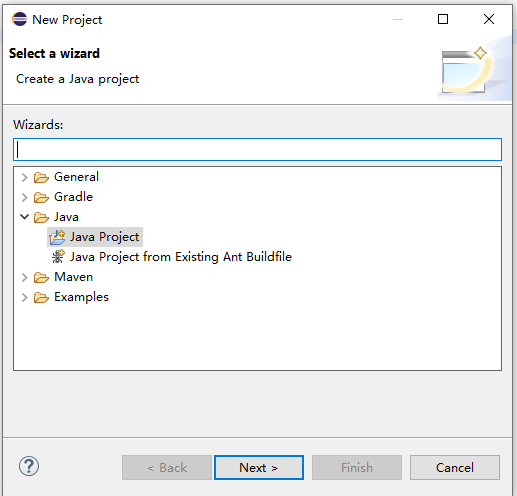
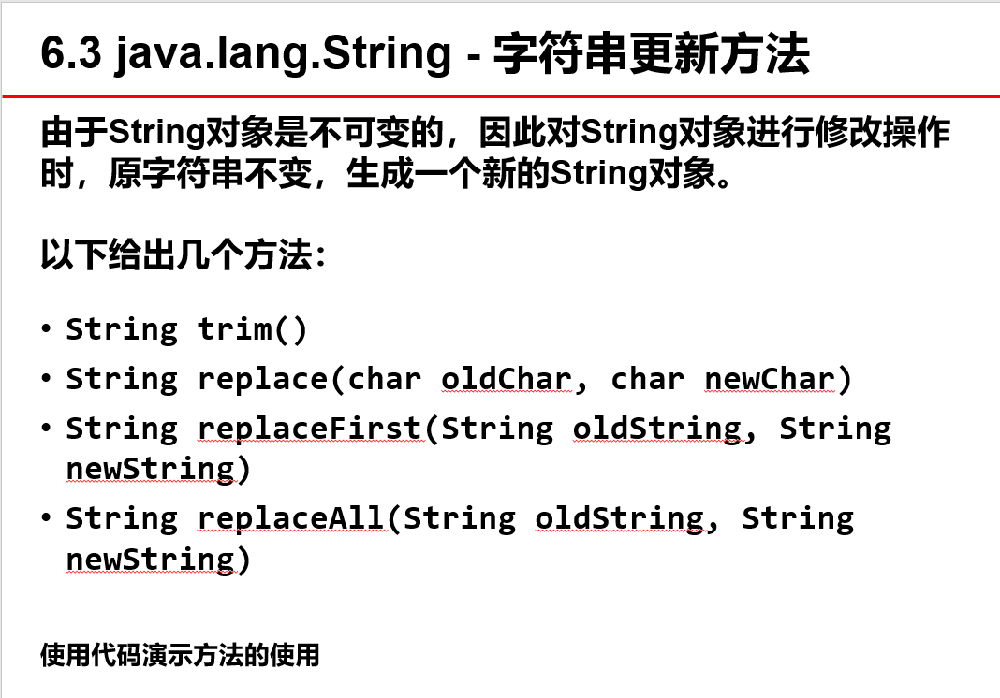
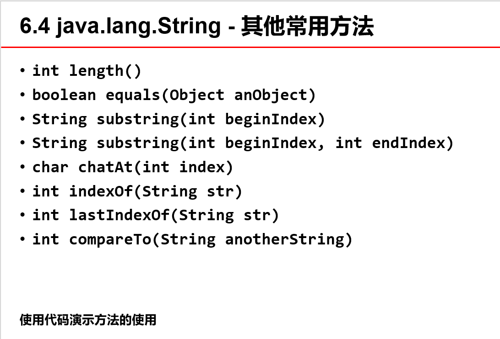
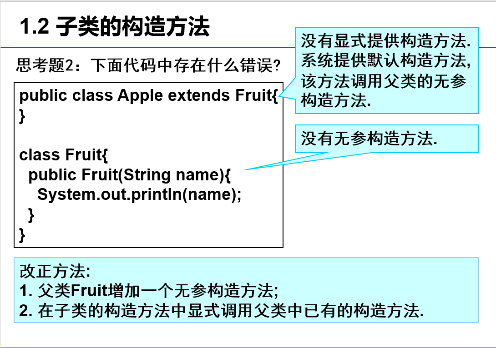

# 

# Eclipse的基本使用
1. File->New->Project...
2. 选择java文件夹，选择Java Project



3. 命名 
4. 右键src文件夹，选择import，选择文件

# Java基本语法
## 基本数据类型
<table>
    <tr>
        <th>int</th>
        <th>short</th>
        <th>long</th>
        <th>float</th>
        <th>double</th>
        <th>char</th>
        <th>boolean</th>
        <th>byte</th>
    </tr>
</table>

- 创建基本数据对象：

```java
int value = 1;
```
- 创建常量：

```java
final double PI = 3.14;
```
- 类型转换:分为自动类型转换(级别低的向级别高的)和强制类型转换(级别高的向级别低的)
<table>
    <tr>
        <th>byte</th>
        <th>short</th>
        <th>char</th>
        <th>int</th>
        <th>long</th>
        <th>float</th>
        <th>double</th>
    </tr>
</table>

```java
float x = 100;//int向float转换 
int k = 'A';//char向int转换
```
```java
int x = (int)100.0;//float向int转换
byte k = (byte)200;//int向byte转换
```

## 数组
1. 声明数组变量
```java
double[] myList;
```

2. 创建数组对象
```java
myList = new int[10];
```

3. 赋值
```java
int[] myList = {1,2,3,4,5};//声明变量时直接赋值
int[] numbers;
numbers = new int[]{1,2,3,4,5};//先声明数组变量，再赋值
```
- 注意：如果是`numbers = new int[10];`不进行赋值，java默认numbers为全0数组。

### 数组的遍历
1. for(初始值；条件；操作);
2. python方法：for(int x : array);

### 数组的复制
1. 循环方法复制
2. `System.arraycopy(a,0,b,0,a.length);`
3. `int[] b = a.clone();`

### java.util.Arrays
1. Array.binarySearch();
2. Array.sort();
3. Array.equals();

## 字符串
### 构造
```java
String m = new String("wdnmd");
String m = "wdnmd";

char[] a = {'w','d','n','m','d'};
String m = new String(a);
```

### java.lang.String




## 随机数
### java.util.Random
```java
Random r = new Random(1);//创建Random实例，1为seed，不同的seed会产生不同的随机数
int rd = r.nextInt(100);//100为范围
```
### Math.random()
```java
double d = Math.random();//随机产生0~1的double类型的数
```

### System.currenTimeMillis()
```java
long l = System.currenTimeMillis();//根据时间产生long类型的随机数
```


## 类的继承
### 基本语法
```java
public class C2 extends C1
```
- 子类并不继承父类的创建方法，需要用到`super()`或`super(参数)`方法来继承
```java
public class C2 extends C1{
    super();
    super(int foo);
    //...
}
```
- 如果子类不提供构造方法，java将自动提供父类的无参构造方法


### 方法覆盖
- 和重写有区别，用于对父类方法的覆盖
```java
public class C1{
    int foo = 1;
    public void printData(){
        System.out.println('test');
    }
public class C2 extends C1{
    int foo = 100;
    @Override
    public void printData(){
        System.out.println('bar');
    }
}
}
```

### 方法重写
- 对于静态方法，直接重写就可以了，不需要加@Override

### super访问父类数据
```java
public class Parent{
	protected int data = 1;
	public void printData() {
		System.out.println(data);
	}
}
public class Child extends Parent{
	private int data = 2;
	public void printData(){
		System.out.println(data);      //2，Child的data
		System.out.println(this.data); //2，Child的data
		System.out.println(super.data);//1，Parent的data
	}
}
public class Hello{
	public static void main(String[] args) {
		Parent p = new Parent();
		Child c = new Child();
		c.printData();
	}
}
```


