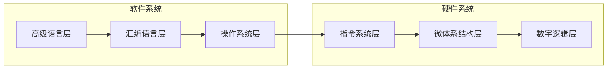

# 主要内容
1. 计算机的层次结构
2. 计算机如何执行程序
3. 运算器的功能、组成和运行原理
 - 程序的功能是如何实现的
4. 控制器的功能、组成和运行原理
 - 程序是如何执行的
 - 怎样能执行得快一些
5. 存储器及层次存储器系统

# Project
1. 在FPGA上使用硬件描述语言VHDL实现Datapath
2. 在FPGA上使用硬件描述语言VHDL实现存储和外设的访问（较难）
3. 实现指令支持流水的CPU（完整的系统）
4. 选做
 - 尽量消除指令之间的冲突，进行性能分析和比较
 - 扩展功能：中断
 - 扩展功能：应用程序、编译器、监控程序

# Ucore（选做）
- 运行Ucore，流水CPU，可以在Ucore下运行应用程序
- https://www.bookstack.cn/read/simple_os_book/zh-preface-ucore.md


# 一、计算机系统概论
## 1.1 计算机系统的层次结构
|第三级|高级语言机器|将高级语言先翻译成汇编语言程序，再在M<sub>2</sub>、M<sub>1</sub>（或直接到M<sub>1</sub>）上执行|
|:---:|:---:|:---:|
|第二级|汇编语言机器|将汇编语言程序通过汇编器先翻译成机器语言程序，再在M<sub>1</sub>上执行|
|第一级|机器语言机器|机器语言程序直接在M<sub>1</sub>上进行（MIPS指令——Microprocessor without interlocked piped stages）|
|第零级|微指令系统|由硬件直接执行微指令|
- **程序的最小单元是指令，同时，指令也是计算机硬件执行程序的最小单位**

## 1.2 图灵结构

## 1.3 香农结构

## 1.4 冯·诺依曼结构计算机
- 冯诺依曼结构计算机是一种**存储结构计算机**
 - 输入程序，将程序存入到内存中
 - 程序由指令构成
 - 程序功能通过指令序列描述
 - 指令序列在存储器中顺序存放
     - 顺序执行指令
         - 用PC指示当前被执行的指令（指针）
         - 从存储器中读出指令执行
         - PC指向下一条指令

## 1.5 计算机的工作步骤
- 计算机会将指令和操作数都存在存储器中
### 1.5.1 存储器
- 主存储器包括存储体，MDR，MAR
```mermaid
graph LR
    存储体->存储单元
    存储单元->存储元件
```
### 1.5.2 运算器

### 1.5.3 控制器


## 1.6 指令和指令系统
### 1.6.1 基本概念
- 计算机系统由硬件和软件两大部分组成。硬件由中央处理器、存储器以及外围设备等组成的实际装置。软件是为了使用计算机而编写的各种系统的和用户的程序。**程序由一个序列的计算机指令组成**
- 指令是计算机运行的最小的功能单元，是指挥计算机硬件运行的命令，是由多个二进制位组成的位串，是计算机硬件可以直接识别和执行的信息体。**指令中应指明指令所完成的操作，并明确操作对象。**
- **一台计算机提供的全部指令构成改计算机的指令系统。**指令用于程序设计人员告知计算机执行一个最基本运算、处理功能，多条指令可以组成一个程序，完成一项预期的任务。

### 1.6.2 指令系统在计算机中的地位
- 可以从6个基本层次分析和看待计算机系统的基本组成

- 指令系统层处在硬件系统和软件系统之间，是硬、软件之间的接口部分，对两部分都有重要影响。
- 硬件系统用于实现每条指令的功能，解决指令之间的衔接关系。
- 软件由按一定规则组织起来的许多条指令组成，完成一定的数据运算或者事务处理功能。
**指令系统的优劣是一个计算机系统是否成功的关键因素。**

### 1.6.3 指令功能分类
1. 数据运算指令
 - 算术运算、逻辑运算
2. 数据传输指令
 - 寄存器之间、主存/寄存器之间
3. 输入/输出指令
 - 与输入/输出端口的数据传输
4. 控制指令
 - 转移指令、子程序调用/返回
5. 其他指令
 - 停机、开关中断、空操作、特权、置条件码

### 1.6.4 指令格式
- 指令字中操作码和操作数地址的二进制位的分配方案
|操作码|操作数地址|
|:---:|:---:|
 - 操作码：指明本条指令的操作功能，每条指令有一个确定的操作码
 - 操作数地址：说明操作数存放的地址，有时是操作数本身
- 指令字：完整的一条指令的二进制表示，指令字最后是存在机器字里面的
- 指令字长：指令字中二进制代码的位数
 - 机器字长：计算机能直接处理的二进制数据的位数(32bit、64bit)
 - 指令字长（字节倍数）=0.5、1、2...个机器字长

### 1.6.5 寻址方式
**寻址方式指的是确定本条指令的操作数地址及下一条要执行的指令地址的方法**
*MIPS和x86寻址方式的区别*
- 通常需要在治疗中为每一个操作数专设一个地址字段，用来表示数据的来源或去向的地址。
 1. 在指令中给出的操作数（或指令）的地址被称为形式地址。
 2. 使用形式地址信息并按一定规则计算出来或读操作得到的一个数值才是数据（或指令）的实际地址。
 3. 在指令的操作数地址字段，可能要指出：
      1. 运算器中累加器的编号或专用寄存器名称（编号）
      2. 输入/输出指令中用到的I/O设备的入出端口地址
      3. 内存储器的额一个存储单元（或一I/O设备）的地址

## 1.7 评价计算机性能的指标
1. 吞吐率
 - 单位时间完成的任务的数量
2. 响应时间
 - 完成任务的时间
3. 衡量性能的指标
 - MIPS
 - CPI（每条指令的平均周期数）
 - CPU time（执行完一段程序所用的CPU时间）
 - CPU Clock
4. 综合测试程序（测试床）

## 1.8 MIPS指令系统
1. Microprocessor without interlocked piped stages
 - 无内部互锁流水级的微处理器
 - RISC芯片
2. Million Instructions Per Second
 - 计算机性能指标之一

### 1.8.1 MIPS指令格式
1. 寄存器型
|op|rs|rt|rd|shamt|funct|
|:---:|:---:|:---:|:---:|:---:|:---:|

- 例如`add $1,$2,$3`   ==   R1<-R2+R3
2. 立即数型
|op|rs|rt|address/immediate|
|:---:|:---:|:---:|:---:|
- 例如：`lw $1,$2,100`   ==   R2<-M[R1+100]
- `addi $1,$2,100`   ==   R2<-R1+100
3. 转移型
|op|target|
|:---:|:---:|
- 例如：`j 8000`   ==   转移到PC[31..28]|8000×4
**所有的指令都是32位字长**
**操作数寻址方式有基址加16位位移量的访存寻址、立即数寻址和寄存器寻址3种**

