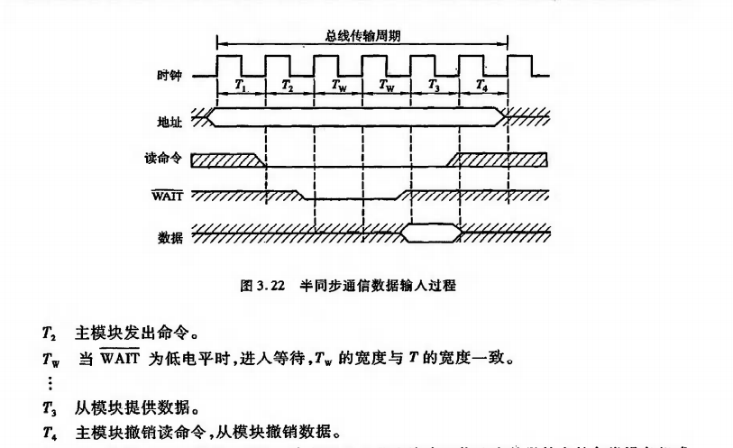

# 主要内容
1. 计算机的层次结构
2. 计算机如何执行程序
3. 运算器的功能、组成和运行原理
 - 程序的功能是如何实现的
4. 控制器的功能、组成和运行原理
 - 程序是如何执行的
 - 怎样能执行得快一些
5. 存储器及层次存储器系统

# Project
1. 在FPGA上使用硬件描述语言VHDL实现Datapath
2. 在FPGA上使用硬件描述语言VHDL实现存储和外设的访问（较难）
3. 实现指令支持流水的CPU（完整的系统）
4. 选做
 - 尽量消除指令之间的冲突，进行性能分析和比较
 - 扩展功能：中断
 - 扩展功能：应用程序、编译器、监控程序

# Ucore（选做）
- 运行Ucore，流水CPU，可以在Ucore下运行应用程序
- https://www.bookstack.cn/read/simple_os_book/zh-preface-ucore.md

# 一、计算机系统概论
## 1.1 计算机系统的层次结构
|第三级|高级语言机器|将高级语言先翻译成汇编语言程序，再在M2、M1（或直接到M1）上执行|
|:---:|:---:|:---:|
|第二级|汇编语言机器|将汇编语言程序通过汇编器先翻译成机器语言程序，再在M1上执行|
|第一级|机器语言机器|机器语言程序直接在M1上进行（MIPS指令——Microprocessor without interlocked piped stages）|
|第零级|微指令系统|由硬件直接执行微指令|
- **程序的最小单元是指令，同时，指令也是计算机硬件执行程序的最小单位**

## 1.2 图灵结构

## 1.3 香农结构

## 1.4 冯·诺依曼结构计算机
- 冯诺依曼结构计算机是一种**存储结构计算机**
 - 输入程序，将程序存入到内存中
 - 程序由指令构成
 - 程序功能通过指令序列描述
 - 指令序列在存储器中顺序存放
     - 顺序执行指令
         - 用PC指示当前被执行的指令（指针）
         - 从存储器中读出指令执行
         - PC指向下一条指令

## 1.5 计算机的工作步骤
- 计算机会将指令和操作数都存在存储器中
### 1.5.1 存储器
- 主存储器包括存储体，MDR，MAR

### 1.5.2 运算器

### 1.5.3 控制器

## 1.6 指令和指令系统
### 1.6.1 基本概念
- 计算机系统由硬件和软件两大部分组成。硬件由中央处理器、存储器以及外围设备等组成的实际装置。软件是为了使用计算机而编写的各种系统的和用户的程序。**程序由一个序列的计算机指令组成**
- 指令是计算机运行的最小的功能单元，是指挥计算机硬件运行的命令，是由多个二进制位组成的位串，是计算机硬件可以直接识别和执行的信息体。**指令中应指明指令所完成的操作，并明确操作对象。**
- **一台计算机提供的全部指令构成改计算机的指令系统。**指令用于程序设计人员告知计算机执行一个最基本运算、处理功能，多条指令可以组成一个程序，完成一项预期的任务。

### 1.6.2 指令系统在计算机中的地位
- 可以从6个基本层次分析和看待计算机系统的基本组成

- 指令系统层处在硬件系统和软件系统之间，是硬、软件之间的接口部分，对两部分都有重要影响。
- 硬件系统用于实现每条指令的功能，解决指令之间的衔接关系。
- 软件由按一定规则组织起来的许多条指令组成，完成一定的数据运算或者事务处理功能。
**指令系统的优劣是一个计算机系统是否成功的关键因素。**

### 1.6.3 指令功能分类
1. 数据运算指令
 - 算术运算、逻辑运算
2. 数据传输指令
 - 寄存器之间、主存/寄存器之间
3. 输入/输出指令
 - 与输入/输出端口的数据传输
4. 控制指令
 - 转移指令、子程序调用/返回
5. 其他指令
 - 停机、开关中断、空操作、特权、置条件码

### 1.6.4 指令格式
- 指令字中操作码和操作数地址的二进制位的分配方案
|操作码|操作数地址|
|:---:|:---:|
 - 操作码：指明本条指令的操作功能，每条指令有一个确定的操作码
 - 操作数地址：说明操作数存放的地址，有时是操作数本身
- 指令字：完整的一条指令的二进制表示，指令字最后是存在机器字里面的
- 指令字长：指令字中二进制代码的位数
 - 机器字长：计算机能直接处理的二进制数据的位数(32bit、64bit)
 - 指令字长（字节倍数）=0.5、1、2...个机器字长

### 1.6.5 寻址方式
**寻址方式指的是确定本条指令的操作数地址及下一条要执行的指令地址的方法**
*MIPS和x86寻址方式的区别*
- 通常需要在治疗中为每一个操作数专设一个地址字段，用来表示数据的来源或去向的地址。
 1. 在指令中给出的操作数（或指令）的地址被称为形式地址。
 2. 使用形式地址信息并按一定规则计算出来或读操作得到的一个数值才是数据（或指令）的实际地址。
 3. 在指令的操作数地址字段，可能要指出：
      1. 运算器中累加器的编号或专用寄存器名称（编号）
      2. 输入/输出指令中用到的I/O设备的入出端口地址
      3. 内存储器的额一个存储单元（或一I/O设备）的地址

## 1.7 评价计算机性能的指标
1. 吞吐率
 - 单位时间完成的任务的数量
2. 响应时间
 - 完成任务的时间
3. 衡量性能的指标
 - MIPS
 - CPI（每条指令的平均周期数）
 - CPU time（执行完一段程序所用的CPU时间）
 - CPU Clock
4. 综合测试程序（测试床）

## 1.8 MIPS指令系统
1. Microprocessor without interlocked piped stages
 - 无内部互锁流水级的微处理器
 - RISC芯片
2. Million Instructions Per Second
 - 计算机性能指标之一

### 1.8.1 MIPS指令格式
1. 寄存器型
|op|rs|rt|rd|shamt|funct|
|:---:|:---:|:---:|:---:|:---:|:---:|

- 例如`add $1,$2,$3`   ==   R1<-R2+R3
2. 立即数型
|op|rs|rt|address/immediate|
|:---:|:---:|:---:|:---:|
- 例如：`lw $1,$2,100`   ==   R2<-M[R1+100]
- `addi $1,$2,100`   ==   R2<-R1+100
3. 转移型
|op|target|
|:---:|:---:|
- 例如：`j 8000`   ==   转移到PC[31..28]|8000×4
**所有的指令都是32位字长**
**操作数寻址方式有基址加16位位移量的访存寻址、立即数寻址和寄存器寻址3种**

# 第三章——系统总线
## 3.1——总线的概念
> 总线是连接多个部件的信息传输线，是各部件共享的传输介质
> 总线有串行和并行两种传输方式
>> 串行传输适合远距离传输，并行传输适合在短程内进行
>> 串行和并行通信的数据传送速率与距离成反比

## 3.2——不同总线结构
1. 单总线结构

> 单次只能允许一个部件向总线传输信息
> CPU、主存和各种I/O设备都通过一条总线传输数据，工作效率低
------
2. 面向CPU的双总线结构

> CPU-主存：M总线（存储总线）
> CPU-外设：I/O总线
> 但是主存和其他I/O设备都与CPU互联，使得CPU占用太多
>> 比如说在读数据的时候就不可以同时与I/O设备传输数据
-------
3. 以存储器为中心的双总线结构

> 两条总线：系统总线和存储总线
>> CPU和主存之间用系统总线互连，所有设备又通过系统总线互连
>> 这样I/O设备在与存储器交换信息时不经过CPU
> 解决了以CPU为中心的问题，有效提高了传输效率
-------
4. 双总线结构

> **首先需要了解一点，I/O设备工作速度并不是一样的，有些非常高速，这一点在后面的结构一样要注意**
> 两条总线：主存总线和I/O总线
> 此结构与面向存储器的双总线结构不一样，**通过通道对I/O设备进行统一管理**
-------
5. 三总线结构

> 因为以CPU为中心，所以速率有所影响
>> 这和以CPU为核心的双总线结构相似
>> 不同的地方在于：主存和某些高速外设通过DMA(Direct Memory Access)总线相连，使得高速的外设可以更快速地和主存传输数据
-------
6. 有高速缓存的三总线结构

> CPU和Cache利用局部总线相连，Cache控制器将Cache连接到局部总线和系统总线上。主存通过Cache和CPU间接传递数据
> 主存与I/O设备传输不需要经过CPU，扩展总线将外设连接起来，每个接口又可以连一堆设备
> 扩展总线利用扩展总线接口与系统总线相连
> 缺点：无论是否高速，I/O设备都连接到了扩展总线上
--------
7. 四总线结构

> 跟三总线比多了一条高速总线，使得这些高速设备与CPU关系更密切
--------
8. 传统微型计算机的总线结构

> 采用了双总线结构
> 一条系统总线，一条I/O总线
--------
9. VL-BUS局部总线结构

> 采用了三总线结构
> 高速设备挂在局部总线上
> VL-BUS：高速总线
> ISA、EISA：低速总线
> VL-BUS在CPU与高速设备之间加了个高速通道，高性能外设充分发挥。但VL-BUS是从CPU总线演化来，与CPU关系太紧密，很难支持更强CPU
---------
10. PCI总线结构

> PCI桥使得两条总线相互独立，还可以连接很多PCI总线
> 外设也是分为高速和低速两种总线
> 当PCI总线驱动能力不足时，可采用多层结构

-------
11. 多层PCI总线结构

## 3.3——总线的分类
1. 片内总线
> 片内总线是指芯片内部的总线，如在CPU芯片内部，寄存器与寄存器之间、寄存器与算逻单元ALU之间
2. 系统总线
> 1. 数据总线：双向，与机器字长、存储字长有关
> 2. 地址总线：单向，与存储地址、I/O地址有关
> 3. 控制总线：有出有入，存储器读、存储器写、总线允许、中断确认
3. 通信总线
> 用于计算机系统之间或计算机系统与其它系统之间的通信。
> 1. 串行通信总线：USB、网线、COM
> 2. 并行通信总线：光驱、打印机

## 3.4——总线特性和性能指标
>1. 机械特性
> - 尺寸、形状、管脚数、排列顺序
>2. 电气特性
> - 传输方向、有效的电平范围
>3. 功能特性
> - 每根传输线的功能：地址、数据、控制
>4. 时间特性
> - 信号的时序关系
>5. 软件特性
> - 驱动

> - 总线宽度：数据线的根数
> - 总线带宽：每秒传输的最大字节数（MBps）
>   - 计算题：总线频率为33MHz，有32条总线，求带宽
>   - 33x(32/8)=132MBps
>   - 增加带宽：
>     - 增加频率
>     - 增加线数：容易出现干扰
> - 时钟同步/异步：总线上的数据与时钟同步工作的总线称为同步总线，与时钟不同步工作的总线称为异步总线
> - 总线复用：比如地址和数据总线共用一条物理线路
> - 信号线数：地址、数据、控制三种总线的总和
> - 总线控制方式：包括突发工作、自动配置、仲裁方式、逻辑方式、计数方式等
> - 其他指标：负载能力、电源电压（3.3V/5V）、总线宽度能否扩展

负载能力:即驱动能力，是指当总线接上负载后，总线输入输出的逻辑电平是否能保持在正常的额定范围内。

## 3.5——总线标准
1. ISA
2. EISA
> 扩展ISA
3. VESA
> 将高速I/O设备直接挂到CPU上
4. PCI
> 1. 高性能
> 2. 良好的兼容性
> 3. 支持即插即用
> 4. 支持多主设备能力
>> - 允许任何主设备和从设备之间实现点到点对等存取
> 5. 具有与处理器和存储器子系统完全并行操作的能力
>> - PCI总线可视为CPU与外设之间的一个中间层，它通过PCI桥路（PCI控制器）与CPU相连。PCI桥路有多级缓冲，可把一批数据快速写入缓冲器中，在这些数据不断写入PCI设备过程中，可真正实现与处理器/存储器子系统的安全并发工作。
> 6. 提供数据和地址奇偶校验功能
> 7. 支持两种电压标准：5V和3.3V
>> - 3.3V可用于便携式微型计算机中
> 8. 可扩充性好
> 9. 软件兼容性好
> 10. 采用多路复用技术
5. AGP
> 加速图形端口
6. RS-232
7. USB

|总线标准|数据线|总线时钟|带宽|
|:---:|:---:|:---:|:---:|
|ISA|16|8MHz(独立)|16MBps|
|EISA|32|8MHz(独立)|33MBps|
|VESA(VL-BUS)|32|33MHz(独立)|133MBps|
|PCI|32|33MHz(独立)|132MBps|
|PCI|64|66MHz(独立)|528MBps|
|AGP|32|66.7MHz(独立)/133MHz(独立)|266MBps/533MBps|
|RS-232|串行通信总线标准|数据终端设备（计算机）和数据通信设备（调制解调器）之间的标准接口||
|USB|串行接口总线标准|普通无屏蔽双绞线/带屏蔽双绞线/最高/最高|1.5 Mbps (USB1.0)/12 Mbps (USB1.0)/480 Mbps (USB2.0)/5.0Gbps(USB3.0)|

## 3.6——总线控制
### 总线判优控制——优先级仲裁
1. 基本概念
> - 主设备（模块）：对总线有控制权
> - 从设备（模块）：相应从主设备发来的消息命令
> - 总线判优控制
>>   - 集中式
>>>    - 链式
>>>    - 计数器定时
>>>    - 独立请求
>>   - 分布式：适用于不存在集中式的情况

2. 链式查询

3. 计数器定时查询

4. 独立请求查询

### 总线通信控制

#### 总线通信的四种方式
1. 同步通信
> 通信双方由统一时标控制数据传送称为同步通信

> 图中总线传输周期是连接在总线上的两个部件完成一次完整且可靠的信息传输时间，它包含4个时钟周期T1、T2、T3、T4
> CPU在T1上升沿发出地址信息
> 在T2上升沿发出读命令，注意这里低电平为有效信号
> 与地址信号相符合的输入设备按命令进行一系列内部操作，且必须在T3的上升沿到来之前将CPU所需的数据送到数据总线上
> CPU在T3时钟周期内将数据线上的信息送到其内部寄存器中
> CPU在T4的上升沿撤销读命令，输入设备不再向数据总线上传送数据

> 主模块在T1上升沿发出地址信息
> 在T2上升沿到来之前开始将数据送到数据总线上
> 主模块在T2上升沿发出写命令
> 主模块在T4上升沿撤销写命令和数据等信号

> 同步通信的有点事规定明确、统一，模块间的配合简单一致
> 缺点是主、从模块时间配合属于强制性同步，必须在限定时间内完成规定的要求，必须按最慢速度的部件来设计公共时钟，严重影响总线的工作效率
> 同步通信一般用于总线长度较短，各部件存取时间比较一致的场合
> 在同步通信的总线系统中，总线传输周期越短，数据线的位数越多，直接影响总线的数据传输率

2. 异步通信
 
 
 
 1. 不互锁
 
 
 
 2. 半互锁
 
 
 
 3. 全互锁
 
 

> 波特率(bps)：指每秒发送的比特数
> 比特率(bps)：指每秒发送的有效（有意义）的比特数
3. 半同步通信

> 注意WAIT低电平有效
> 半同步最大的特点就是增加了一个等待的时间
> 半同步适用于系统工作速度不高但又包含了由许多工作速度差异较大的各类设备组成的简单系统。半同步通信控制方式可以使得全系统内各模块在统一的系统时钟控制下同步工作，可靠性高，同步结构方便。
> 缺点是对系统时钟频率不能要求太高

4. 分离式通信
- 在以上三种通信中，对系统总线而言，从模块内部读取数据的过程并无实质性的信息传输，总线处于空闲。
> 基本思想：将一个传输周期分解为两个子周期
>> 子周期1：主模块申请占用总线，使用完后即放弃总线的使用权
>> 子周期2：从模块（相对于上面的主模块）申请占用总线，将各种信息送至总线上
- 分离式通信特点：
> 1. 各模块有权申请占用总线
> 2. 采用同步方式通信，不等对方回答
> 3. 各模块准备数据时，不占用总线
> 4. 总线被占用时，无空闲
> 5. 充分提高了总线的有效占用

# 第四章————存储器

## 存储器分类
1. 按存储介质分类
> 半导体存储器：TTL、MOS            易失
> 磁表面存储器：磁头、载磁体        非易失
> 磁芯存储器：硬磁材料、环状元件    非易失
> 光盘存储器：激光、激光材料        非易失
2. 按存取方式分类
> 1. 存取时间与物理地址无关（随机访问）
> - 随机存储器(RAM-Random Access Memory)：存储器的任何一个存储单元的内容都可以随机存取，在程序的执行过程中可读可写
> - 只读存储器(ROM-Read Only Memory)：在程序的执行过程中只读
>> 只读存储器又分为：
>> - 掩模型只读存储器(MROM-Masked ROM)：无法更改内容
>> - 可编程只读存储器(PROM-Programmable ROM)
>> - 可擦除可编程只读存储器(EPROM Erasable Programmable ROM)
>> - 用电可擦除可编程只读存储器(EEPROM-Electrically Erasable Programmable ROM)
>> - 闪存(Flash Memory)
> 2. 存取时间与物理地址有关
> - 顺序存取存储器：磁带
> - 直接存取存储器：磁盘

3. 按在计算机中的作用分类

## 缓存-主存层次和主存-辅存层次

> CPU、缓存、主存合为缓存-主存层次
>> 缓存-主存层次主要解决CPU和主存速度不匹配的问题。
>> 因为缓存的速度比主存快，所以CPU直接从缓存中获取信息
>> 但由于缓存的容量小，因此需要不停地从主存中获取数据更新缓存
> 主存、辅存合为主存-辅存层次
>> 主存-辅存层次主要解决存储系统的容量问题

## 主存储器
- MAR:存储器地址寄存器
- MDR:存储数据寄存器
- 根据MAR中的地址访问某个存储单元时，还需经过地址译码、驱动等电路，才能找到所需访问的单元
- 读出时，需经过放大器，才能将被选中单元的存储字送到MDR
- 写入时，MDR中的数据也必须经过写入电路才能真正写入到被选中的单元中

1. 读取操作
> 1. CPU将要读取的字的地址送到MAR 
> 2. 经地址总线送到主存，然后发出读命令
> 3. 主存将内容读出，送到数据总线上
> 4. 数据送到MDR
2. 写入操作
> 1. CPU将要写入的主存地址送到MAR
> 2. MAR将地址信息送到地址总线
> 3. CPU将信息字送到MDR，MDR将数据送到数据总线
> 4. CPU向主存发送写命令
> 5. 主存将数据总线上的数据写入指定位置的主存单元中

### 字地址和字节地址
- 字节长度：无论是什么计算机，都是固定的8位
- 字长：根据不同的计算机的不同情况而定，比如IBM 370机的字长为32位，则为4个字节；PDP-11的字长为16位，则为2个字节
### 字节寻址范围和字寻找范围
- 字节寻址范围：2^地址总线数
- 字寻址范围：字节寻址范围/(字长/8)

### 主存的技术指标
1. 存储容量
- **存储容量是指主存能存放的二进制代码的总位数**
 - 存储容量 = 存储单元个数x存储字长
     - *这里的存储单元指的是一个字，那么存储单元个数指的是MAR的编址能力*
- 用字节总数表示
 - 存储容量 = 存储单元个数x存储字长/8

2. 存储速度
- 存储速度是由存取时间和存取周期来表示的
 1. 存取时间
> **指启动一次存储器操作到完成该操作所需的全部时间**
>> 1. 读出时间
>> - 从存储器接收到有效地址开始，到产生有效输出所需的全部时间（读命令终止）
>> 2. 写入时间
>> - 从存储器接收到有效地址开始，到数据写入被选中单元位置所需的全部时间（写命令终止）
 2. 存取周期
     - 指存储器进行连续两次独立的存储器操作所需的最小间隔时间，通常存取周期大于存取时间

3. 存储器带宽
- **表示单位时间内存储器存取的信息量**
- 单位：位/秒
- 提高存储器带宽的措施：
 - 缩短存取周期
 - 增加存储字长
 - 增加存储体

## 半导体存储芯片
- 译码驱动：能把地址总线送来的地址信号翻译成对应存储单元的选择信号，该信号在读/写电路的配合下完成读/写操作
- 读/写电路包括读出放大器和写入电路
- 地址显示单向的
- 数据线是双向的
- 控制线主要有读/写控制线与片选线两种

- *一列8片构成8位，一共4列构成4x16=64K*

### 半导体存储芯片的译码驱动方式
1. 线选法
- **用一根字选择线直接选中一个存储单元的全部位**
2. 重合法
- **类似二维数组的取值方法，两根选择线构成X,Y坐标**

## 随机存取存储器
1. 静态RAM
 1. 静态RAM基本单元电路

> 存储器中一个基本单元电路只能存储1bit
>> - T1、T2、T3、T4组成一个触发器基本电路
>> - T1到T6构成一个基本单元电路，即用来存储0和1
>> - T5、T6受行地址选择线控制
>> - T7、T8受列地址选择线控制，分别与位线A、A'相连
>> - A高电平表示1，A'高电平表示0
>>> 1. 行地址选择线有电，打开T5、T6
>>> 2. 列地址选择先有电，打开T7、T8
>>> 3. 读选择线有电
>>> 4. A点高电平通过T6，经过位线A，通过T8，最后经过放大器输出
- 写操作
> 1. 写选择有电
> 2. 经过两个写放大器，使两端输出为相反电平
> 3. 行选择、列选择有电
> 4. T5、T6、T7、T8打开
> 5. 将A、A'设置为相反电平

 2. 静态RAM芯片举例
 
 > I/O：数据输入输出端 
 > WE：写允许信号
 > CS：片选信号
 > Vcc：电源端
 > GND：接地端
 